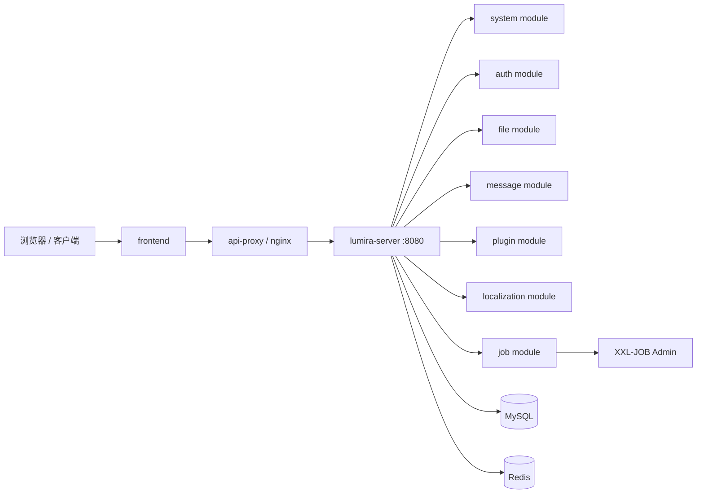

# lumira

企业级 SaaS 单体微服务平台底座。

当前正式架构已经从“多进程纯微服务”收敛为“单体微服务”：生产和本地默认只启动一个后端进程 `services/lumira-server`，由它聚合系统、认证、文件、消息、插件、本地化和任务能力。代码仍按 `services/*-service` 保留清晰模块边界，后续需要重新拆成独立微服务时，可以按现有模块、契约和数据 owner 分批拆出。

## 架构原则

- 一个运行入口：默认后端入口是 `services/lumira-server`，端口 `8080`。
- 多个业务边界：`auth-service`、`system-service`、`file-service`、`message-service`、`plugin-service`、`localization-service`、`job-executor` 仍是 Maven 模块和包边界。
- 公共能力下沉：通用响应、安全、领域基础、Web 基础、跨模块 API 放在 `libs/*`。
- 不直接共享内部实现：跨模块调用优先走 `libs/lumira-api` 中的契约、应用服务接口或明确的内部接口，避免随意穿透别的模块表和实现类。
- 可拆分优先：新增能力先明确 owner、表归属、API 契约和异步事件，再决定是否物理拆服务。

## 仓库概览

- `frontend/`：基于 React、TypeScript、Umi Max、Ant Design 和 ProComponents 的前端工程。
- `services/lumira-server/`：正式后端启动入口，聚合所有后端业务模块。
- `services/system-service/`：系统、配置、菜单、用户、审计、AI 等核心系统能力。
- `services/auth-service/`：登录、刷新 token、二次验证、Passkey、微信登录等认证能力。
- `services/file-service/`：文件、图片、存储空间和上传安全校验。
- `services/message-service/`：站内信、消息归档、WebSocket 推送。
- `services/plugin-service/`：插件管理、插件运行时、插件网关。
- `services/localization-service/`：语言、命名空间、翻译词条和发布。
- `services/job-executor/`：XXL-JOB 执行器和后台任务。
- `libs/common-*`、`libs/lumira-api`、`libs/plugin-api`：公共契约和基础能力模块。
- `deploy/`：容器编排、Nginx、可观测性和生产部署资源。
- `docs/`：架构、数据库、权限、部署、服务边界和运维说明。

## 当前运行拓扑



`LEGENDARY_MONOLITH=true` 是默认运行模式。各模块的独立 `application.yml` 和端口配置作为未来拆分准备保留，但默认启动、部署、监控和健康检查都以 `lumira-server` 为准。

## 本地启动

环境要求：

- Java 21
- Maven 3.9+ 或仓库内 Maven Wrapper
- Node.js 20+
- pnpm 10+
- Docker，可选但推荐用于 Redis、MySQL 和部署演练

一键启动默认构建并启动单体微服务容器：

```bash
node scripts/start-platform.mjs
```

如果不想重新构建镜像：

```bash
node scripts/start-platform.mjs --skip-build
```

停止：

```bash
node scripts/stop-platform.mjs
```

也可以只构建后端聚合入口：

```bash
./mvnw -pl services/lumira-server -am package
```

本地直接运行聚合后端：

```bash
./mvnw -pl services/lumira-server -am spring-boot:run
```

默认后端地址：

- 后端：`http://localhost:8080`
- 健康检查：`http://localhost:8080/actuator/health`
- API 代理：`http://localhost:8000`

## 部署

生产部署以后端聚合容器为准：

```bash
node scripts/deploy-container.mjs --rebuild
```

常用操作：

```bash
node scripts/deploy-container.mjs --ps
node scripts/deploy-container.mjs --logs
node scripts/deploy-container.mjs --stop
```

部署编排中的核心后端服务是 `lumira-server`，`api-proxy` 只反向代理到它。可观测性也默认抓取 `lumira-server:8080`。

## 后续拆分方式

如果后续要重新拆为物理微服务，按这个顺序做：

1. 选择一个 owner 模块，例如 `file-service` 或 `message-service`。
2. 确认它的表归属、迁移脚本、API 契约、权限键和事件边界已经独立。
3. 给该模块恢复独立启动类、独立部署服务和健康检查。
4. 将 `lumira-server` 内部调用改成 HTTP/Feign 或消息事件调用。
5. 在代理或网关层把对应路径路由到新服务。
6. 保留 `lumira-server` 中的兼容调用，完成灰度后再移除聚合依赖。

拆分时不要先从 Docker 或端口开始拆。先拆 owner、契约和数据边界，再拆进程边界。

## 验证命令

```bash
./mvnw -pl services/lumira-server -am -DskipTests package
./mvnw -pl services/system-service -am test
corepack pnpm --dir frontend typecheck
node scripts/check-deployment.mjs
git diff --check
```

## 维护约束

- 新增后端功能优先落在明确的 `services/*-service` 模块中，再由 `lumira-server` 聚合运行。
- 不再新增 `backend` 单体入口。
- 不把同一业务同时做成“聚合模块一份、独立服务一份”的双实现。
- 文档、脚本、监控、部署默认都说 `lumira-server`，只有拆分设计或兼容说明才使用独立服务端口。
