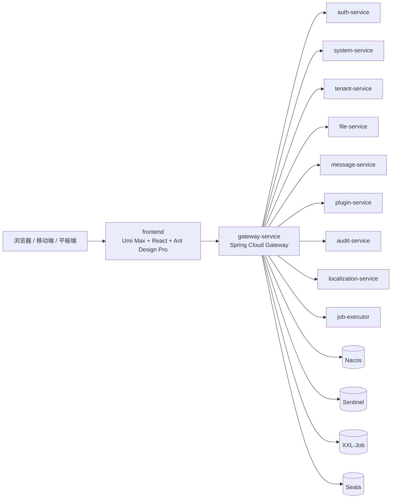

# legendary-invention

企业级多租户 SaaS 平台第一轮工程底座仓库。

这个仓库的目标不是做一个普通后台模板，而是沉淀一套可长期演进的前后端基础设施。当前阶段已经从模块化单体演进到微服务平台骨架，重点覆盖多租户、认证授权、统一请求链路、网关入口、配置中心、服务治理、定时任务、分布式事务和插件化扩展能力。

## 仓库概览

- `frontend/`：基于 `React 18`、`TypeScript`、`Umi Max`、`Ant Design 5` 和 `Ant Design Pro` 的前端工程。
- `backend/`：当前作为 `system-service` 的后端工程，承载原有核心业务与底层能力。
- `gateway-service/`：统一入口网关。
- `auth-service/`、`tenant-service/`、`file-service/`、`message-service/`、`plugin-service/`、`audit-service/`、`localization-service/`、`job-executor/`：服务拆分骨架。
- `common-core/`、`common-web/`、`common-security/`、`common-tenant/`、`legendary-api/`：公共契约和基础能力模块。
- `docs/`：技术方案、前后端架构、数据库设计、权限模型和初始化说明。
- `database/`：数据库相关资源。
- `examples/`：示例文件。

## 技术栈

### 前端

- `React 18`
- `TypeScript`
- `Umi Max`
- `Ant Design 5`
- `Ant Design Pro`
- `ProComponents`
- `pnpm`

### 后端

- `Java 21`
- `Spring Boot 4.0.6`
- `Spring Cloud 2025.1.1`
- `Spring Cloud Alibaba 2025.1.0.0`
- `Spring Security`
- `Spring Cloud Gateway`
- `Nacos 3.2.1`
- `Sentinel 1.8.9`
- `XXL-JOB 3.4.0`
- `Seata 2.6.0`
- `MyBatis Plus`
- `MySQL 8`
- `Redis`
- `Flyway`
- `Springdoc OpenAPI`
- `JWT`

### 工程与基础设施

- 前后端分离
- 微服务平台优先
- 统一网关入口
- 多租户逻辑隔离
- 统一响应结构和错误码
- 统一日志、审计和可观测上下文
- 插件运行时扩展

## 架构

### 总体架构



### 前端分层

前端按三层组织：

1. `layouts/` 壳层负责主布局、用户布局、空白布局和顶部交互区。
2. `services/`、`auth/`、`tenant/`、`cache/`、`responsive/`、`hooks/` 负责通用能力。
3. `pages/`、`components/` 负责业务页面和可复用组件。

### 后端分层

后端按四层组织：

1. 接口接入层：控制器、参数校验、返回封装。
2. 应用服务层：用例编排和流程控制。
3. 领域规则层：业务规则、状态流转和约束判断。
4. 基础设施层：数据库、缓存、鉴权、租户、日志、Trace、任务和文件等通用能力。

### 关键工作链路

- 前端启动时会恢复登录态和租户上下文。
- 路由守卫会拦截未登录访问，并重定向到登录页。
- 请求层会统一注入 `Authorization`、`X-Tenant-Id`、`X-Request-Id` 等头信息。
- 后端会通过安全过滤器、租户过滤器和 Trace 过滤器建立上下文。
- 后端统一返回 `ApiResponse` 结构，前端统一处理错误码、登录失效和提示信息。

## 工作方式

这个仓库的“工作方式”主要体现在两条链路上。

### 1. 前端如何工作

- 入口在 `frontend/src/app.ts`。
- `getInitialState()` 会尝试恢复会话、当前用户、当前租户、菜单树和可用插件。
- `onRouteChange()` 负责路由守卫和登录跳转。
- `frontend/src/services/common/request.ts` 负责统一请求封装。
- 登录态、租户上下文和错误提示都由公共层处理，业务页面尽量只关注页面本身。

### 2. 后端如何工作

- 外部请求先进入 `gateway-service`，再进入具体业务服务。
- `backend/` 目前承担 `system-service` 的职责，是第一批拆分前的核心业务承载点。
- 认证、租户、权限、审计、配置、文件、任务等能力逐步拆成独立服务。
- `Nacos` 负责注册与配置，`Sentinel` 负责治理，`XXL-Job` 负责调度，`Seata` 负责少量强一致事务。
- `Redis` 负责会话、缓存和部分上下文数据，`Flyway` 负责数据库初始化和演进。

### 3. 典型请求流程

1. 用户从前端发起请求。
2. 请求先到 `gateway-service`，统一做 CORS、路由、基础鉴权和限流。
3. 网关透传 token、租户、TraceId，转发到目标服务。
4. 业务服务完成二次鉴权、租户解析和业务编排。
5. 数据层访问 MySQL / Redis / 文件服务等资源。
6. 需要调度或补偿的动作写入 `XXL-Job` 或 Outbox。
7. 后端返回统一响应，前端根据错误码决定提示、跳转或重新登录。

## 功能现状

当前第一轮底座已覆盖以下能力：

- 前后端工程初始化
- 统一请求封装
- 登录态恢复与路由守卫
- 三类布局骨架
- 统一响应结构和错误码
- Spring Security + JWT 认证骨架
- TenantContext + TenantFilter
- Trace / requestId 透传
- Redis 配置与缓存封装
- Flyway 初始化脚本
- `gateway-service`、`common-*`、`legendary-api` 和业务服务骨架

## 本地安装与启动

### 环境要求

- `Node.js`：建议 `20+`
- `pnpm`：`10.33.0` 或兼容版本
- `Java`：`21`
- `Maven`：`3.9+`
- `MySQL`：`8.x`
- `Redis`：`6.x+`

### 1. 获取代码

```bash
git clone <repository-url>
cd legendary-invention
```

### 2. 启动后端

当前建议先启动基础设施，再启动 `backend/system-service` 和 `gateway-service`。后端默认读取 `backend/src/main/resources/application.yml` 中的环境变量，常用配置包括：

- `DB_URL`
- `DB_USERNAME`
- `DB_PASSWORD`
- `REDIS_HOST`
- `REDIS_PORT`
- `REDIS_PASSWORD`
- `JWT_SECRET`

常用安全相关配置：

- `CORS_ALLOWED_ORIGINS`：生产/测试环境允许的前端 origin 列表，逗号分隔。
- `TRUSTED_PROXY_CIDRS`：受信代理网段，逗号分隔。
- `TRUST_FORWARDED_HEADERS`：是否允许解析代理头，生产环境建议仅在受信代理后开启。
- `DEFAULT_ADMIN_INIT_ENABLED`：仅 `dev` 环境建议开启默认管理员初始化。
- `DEFAULT_ADMIN_PASSWORD_HASH`：默认管理员密码哈希，生产环境不应依赖自动重置。

如果项目提供了 `.env.example`，建议先复制一份再修改本地配置。

```bash
mvn -pl backend -am spring-boot:run
```

默认地址：

- 健康检查：`http://localhost:8080/api/health`
- OpenAPI：`http://localhost:8080/swagger-ui.html`

### 3. 启动前端

前端在 `frontend/package.json` 中使用 `pnpm` 管理依赖。

- 仓库只保留 `pnpm-lock.yaml`，不会提交 `package-lock.json`。
- `frontend/src/.umi` 和 `frontend/src/.umi-production` 都是 Umi 生成产物，构建时自动重建，不需要手工维护。

```bash
cd frontend
pnpm install
pnpm dev
```

默认地址：

- 前端页面：`http://localhost:8000`

### 4. 启动网关

```bash
mvn -pl services/gateway-service -am spring-boot:run
```

默认地址：

- 网关：`http://localhost:8081`

### 5. 常用前端命令

```bash
cd frontend
pnpm build
pnpm start
pnpm typecheck
```

## 目录说明

### 前端

- `src/app.ts`：应用初始化、会话恢复、路由守卫。
- `src/services/common/request.ts`：统一请求层。
- `src/layouts/`：基础布局、用户布局、空白布局。
- `src/pages/`：业务页面和异常页。
- `src/components/`：查询区、表格、抽屉、按钮等通用组件。
- `src/auth/`：token 和会话管理。
- `src/tenant/`：租户上下文。
- `src/responsive/`：响应式策略。

### 后端

- `backend/`：当前 `system-service` 的代码与数据库迁移。
- `gateway-service/`：统一入口网关。
- `common-*`：平台级共享模块。
- `legendary-api/`：服务间契约。

## 推荐阅读

- [技术方案](./docs/01-technical-scheme.md)
- [前端架构](./docs/06-frontend-architecture.md)
- [后端架构](./docs/07-backend-architecture.md)
- [初始化说明](./docs/11-bootstrap-setup.md)

## 贡献约定

- 新增功能优先放入对应业务模块，不要把业务逻辑堆到控制器里。
- 前端请求优先复用 `services/common/request.ts`。
- 涉及租户、权限、审计、错误码和缓存的改动，尽量先对齐统一约定。
- 文档更新要和代码同步，避免 README 和实际启动方式不一致。
