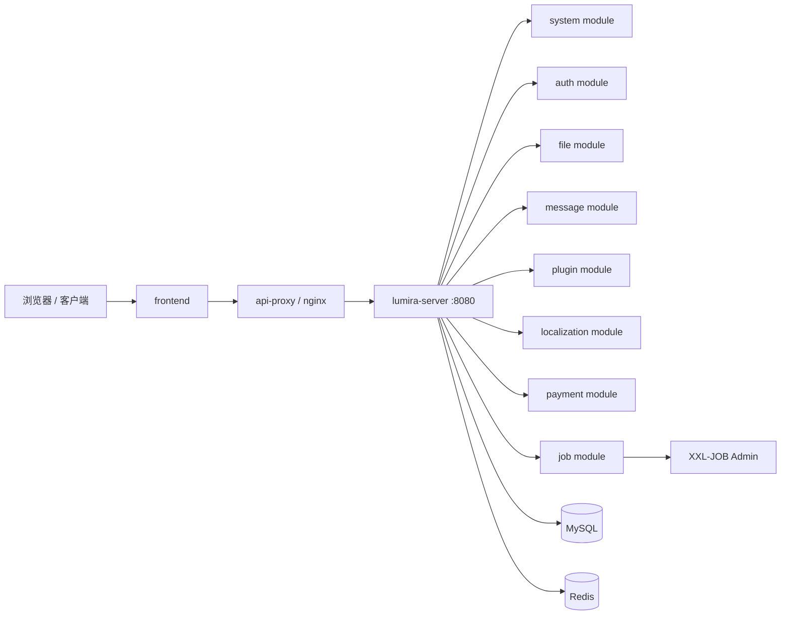

# Lumira

Lumira，意为照亮可能性的光。

我们相信，真正有意义的社会改变，始于清晰的认知、善意的连接和勇敢的行动。Lumira 不只是一个项目，而是一条通往更好社会的道路。它希望让人们看得更清楚，连接得更深，也一起走向一个更值得期待的未来。

在工程实现上，Lumira 是一套面向企业管理场景的 SaaS 平台底座，提供用户、权限、配置、文件、消息、插件、国际化、支付、AI 助手和后台任务等基础能力。项目采用“单体微服务”架构：运行时保持一个后端进程，代码层保留清晰的业务模块边界，兼顾部署简单性和未来拆分弹性。

这个仓库适合作为中后台 SaaS、企业运营系统、插件化平台或 AI 增强型管理系统的起点。

## 核心能力

- 统一认证：登录、刷新 token、二次验证、Passkey、微信登录扩展。
- 权限与组织：用户、角色、菜单、权限、部门、数据范围和安全配置。
- 文件中心：图片、文档、存储空间、上传校验和文件访问控制。
- 消息中心：站内信、消息归档、WebSocket 推送和在线连接管理。
- 插件体系：插件定义、版本管理、租户启用、运行时安全策略和插件网关。
- 国际化：语言、命名空间、翻译词条、发布和运行时读取。
- 支付能力：支付服务商配置、订单、退款、Webhook 和支付事件 outbox。
- AI 能力：AI 员工、知识库、会话、工具调用和平台内 AI 辅助场景。
- 后台任务：XXL-JOB 集成、outbox relay、心跳和异步任务触发。
- 运维支撑：Docker Compose、Nginx、Prometheus、Grafana、日志采集和部署脚本。

## 架构概览

Lumira 当前默认只启动一个后端进程：`services/lumira-server`。它聚合各业务模块，并统一暴露 API、WebSocket、健康检查和运维端点。



虽然运行时是单进程，代码仍按模块组织：

- `services/lumira-server`：正式后端启动入口。
- `services/system-service`：系统、权限、配置、审计、AI 等核心能力。
- `services/auth-service`：认证、会话、登录保护和二次验证。
- `services/file-service`：文件对象、上传、存储空间和文件安全。
- `services/message-service`：站内消息、通知、WebSocket 和消息 outbox。
- `services/plugin-service`：插件管理、插件运行时和插件网关。
- `services/localization-service`：国际化语言、词条、命名空间和发布。
- `services/payment-service`：支付配置、订单、退款和支付事件。
- `services/job-executor`：后台任务、XXL-JOB handler 和 relay 调度。

未来如果需要重新拆成独立微服务，可以按这些模块边界逐个拆分，而不需要重写业务代码。

## 目录结构

```text
Lumira/
├─ frontend/              前端工程
├─ services/              后端启动入口和业务模块
├─ libs/                  公共基础库和跨模块 API 契约
├─ database/              数据库初始化和说明
├─ deploy/                Docker、Nginx、监控和生产部署资源
├─ docs/                  架构、权限、部署、测试和运维文档
├─ scripts/               本地启动、部署、自检和冒烟脚本
├─ pom.xml                Maven 多模块总配置
├─ mvnw / mvnw.cmd        Maven Wrapper
└─ README.md
```

## 技术栈

- 后端：Java 21、Spring Boot 4、MyBatis-Plus、Flyway、Redis、MySQL。
- 前端：React、TypeScript、Umi Max、Ant Design、ProComponents。
- 异步与实时：Outbox、XXL-JOB、WebSocket、SSE。
- 部署：Docker Compose、Nginx、Prometheus、Grafana、Loki、Tempo、Alloy。

## 快速开始

环境要求：

- Java 21
- Node.js 20+
- pnpm 10+
- Docker

启动平台：

```bash
node scripts/start-platform.mjs
```

跳过重新构建：

```bash
node scripts/start-platform.mjs --skip-build
```

停止平台：

```bash
node scripts/stop-platform.mjs
```

常用访问地址：

- 后端：`http://localhost:8080`
- 健康检查：`http://localhost:8080/actuator/health`
- API 代理：`http://localhost:8000`

## 构建与验证

后端编译：

```bash
./mvnw clean compile
```

后端发行包：

```bash
./mvnw -pl services/lumira-server -am -DskipTests package
```

前端生产构建：

```bash
corepack pnpm --dir frontend run build
```

部署自检：

```bash
node scripts/check-deployment.mjs
```

## 部署

生产部署以 `lumira-server` 聚合容器为核心：

```bash
node scripts/deploy-container.mjs --rebuild
```

常用运维命令：

```bash
node scripts/deploy-container.mjs --ps
node scripts/deploy-container.mjs --logs
node scripts/deploy-container.mjs --stop
```

更多部署细节见 [deploy/README.md](deploy/README.md) 和 [docs/11-1panel-container-deploy.md](docs/11-1panel-container-deploy.md)。

## 设计目标

Lumira 的目标是提供一个可以直接落地的企业级平台基础：

- 第一版优先保证部署简单、模块清晰、能力完整。
- 业务模块通过 Maven 模块和包边界隔离。
- 公共能力沉淀到 `libs/*`，跨模块契约沉淀到 `libs/lumira-api`。
- 前端始终通过 `/api` 访问后端，未来拆分服务时不影响前端路径。
- 事件、任务和实时推送通过 Outbox、XXL-JOB、WebSocket 和 SSE 承载。

## 文档

- [技术方案](docs/01-technical-scheme.md)
- [目录与模块说明](docs/10-project-directory-guide.md)
- [后端架构](docs/07-backend-architecture.md)
- [权限设计](docs/05-permission-rbac.md)
- [部署说明](deploy/README.md)
- [测试策略](docs/21-test-strategy-and-cases.md)
- [单体微服务与未来拆分边界](docs/25-monolith-service-split-readiness.md)