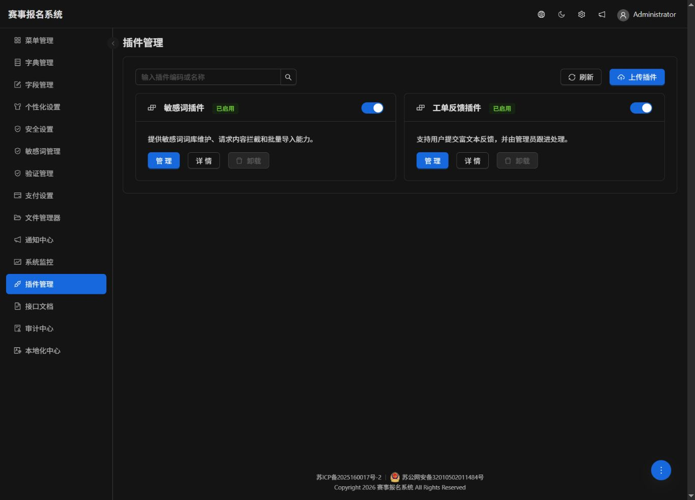
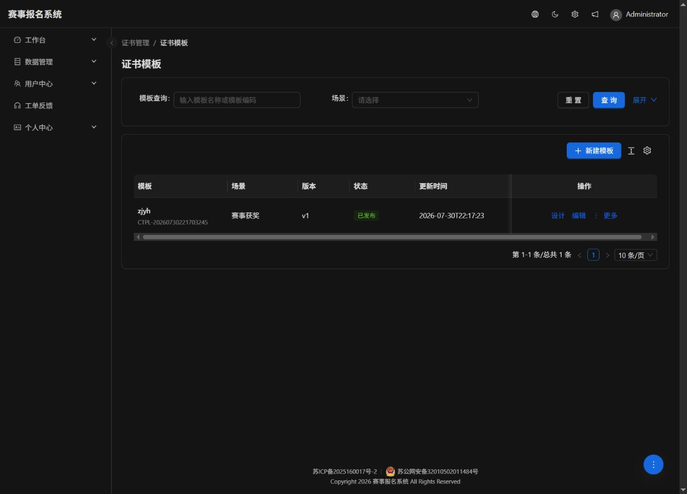

# 管理端缺失页面恢复审计

审计日期：2026-08-06

## 审计范围

1. 主导航与后台菜单树是否一致。
2. 历史管理页是否仍有可用前端页面和后端权限。
3. 被重定向到工作台的管理页是否可以安全恢复。
4. 已整套下线的模块是否具备直接恢复条件。

## 现场证据

### 1. 主导航缺失

线上主导航仅显示工作台、数据管理、用户中心、工单反馈和个人中心；证书管理、专家库、专家评审与工作流没有显示。

### 2. 页面仍可直达

证书模板页可以通过直达 URL 正常打开，说明该类问题是菜单组装遗漏，不是页面实现缺失。

## 结论与处理

| 编号 | 页面组 | 线上状态 | 本次处理 | 健康度 |
| --- | --- | --- | --- | --- |
| 1 | 证书管理 | 页面可直达，主导航缺失 | 补入稳定主导航组 | 已修复 |
| 2 | 专家库 | 页面可直达，主导航缺失 | 补入稳定主导航组 | 已修复 |
| 3 | 专家评审 | 页面可直达，主导航缺失 | 补入稳定主导航组 | 已修复 |
| 4 | 工作流 | 页面可直达，主导航缺失 | 补入稳定主导航组 | 已修复 |
| 5 | 项目管理 | 产品范围内已下线 | 保持菜单禁用和工作台重定向 | 无需恢复 |
| 6 | 团队管理 | 产品范围内已下线 | 保持菜单禁用和工作台重定向 | 无需恢复 |
| 7 | 查询中心 | 产品范围内已下线 | 保持目录和查询页禁用 | 无需恢复 |
| 8 | AI 员工、AI 助手、知识库 | 前后端均被整套删除 | 保持下线 | 无需恢复 |

## 验证

- 前端类型检查通过。
- 前端 86 个测试文件、429 项测试通过。
- 管理路由烟雾测试通过。
- 前端生产构建通过。
- 后端菜单种子与内置路由目录测试通过。
