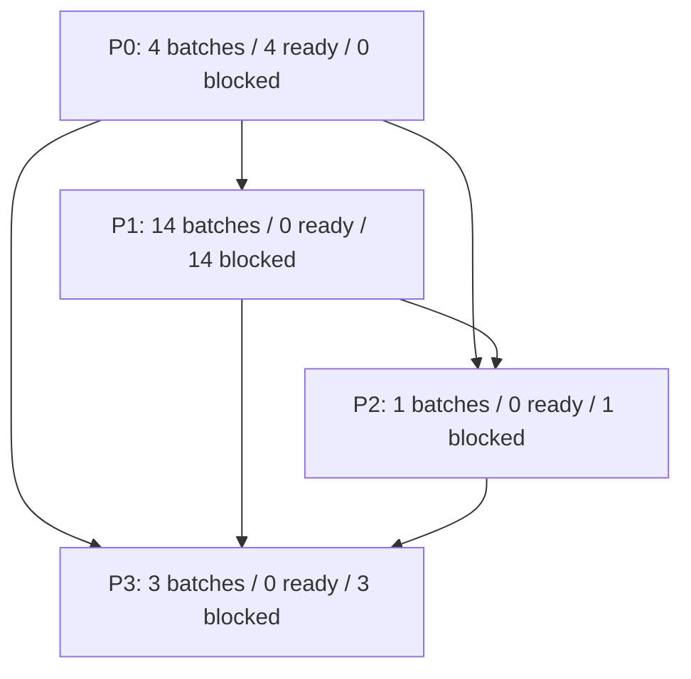

# DDD Release Action Dependency Graph

Generated at: 2026-06-19T18:19:45.629Z
Status: NOT_READY
Release gate mode: strict
Release gate blockers: 94
Batch count: 22
Edge count: 131
Graph density: 0.2835
Compressed edge count: 6

## Execution Levels

- P0: 4 batches, 4 ready, 0 blocked
- P1: 14 batches, 0 ready, 14 blocked
- P2: 1 batches, 0 ready, 1 blocked
- P3: 3 batches, 0 ready, 3 blocked

## Compressed Graph

## Full Graph

```mermaid
flowchart TD
  b_p0_docker_release_infra["P0 docker / release-infra"]
  b_p0_runtime_readiness_release_infra["P0 runtime-readiness / release-infra"]
  b_p0_manifest_lumira_ui["P0 manifest / lumira-ui"]
  b_p0_authenticated_performance_release_performance["P0 authenticated-performance / release-performance"]
  b_p1_ai_runtime_ai["P1 ai-runtime / ai"]
  b_p1_business_e2e_file_owner["P1 business-e2e / file-owner"]
  b_p1_business_e2e_job_owner["P1 business-e2e / job-owner"]
  b_p1_business_e2e_payment_owner["P1 business-e2e / payment-owner"]
  b_p1_rollback_ai_owner["P1 rollback / ai-owner"]
  b_p1_rollback_auth_owner["P1 rollback / auth-owner"]
  b_p1_rollback_file_owner["P1 rollback / file-owner"]
  b_p1_rollback_iam_owner["P1 rollback / iam-owner"]
  b_p1_rollback_job_owner["P1 rollback / job-owner"]
  b_p1_rollback_localization_owner["P1 rollback / localization-owner"]
  b_p1_rollback_message_owner["P1 rollback / message-owner"]
  b_p1_rollback_payment_owner["P1 rollback / payment-owner"]
  b_p1_rollback_platform_owner["P1 rollback / platform-owner"]
  b_p1_rollback_plugin_owner["P1 rollback / plugin-owner"]
  b_p2_explain_database["P2 explain / database"]
  b_p3_orchestrator_database["P3 orchestrator / database"]
  b_p3_orchestrator_release_infra["P3 orchestrator / release-infra"]
  b_p3_orchestrator_release_owner["P3 orchestrator / release-owner"]
  b_p0_docker_release_infra --> b_p1_ai_runtime_ai
  b_p0_runtime_readiness_release_infra --> b_p1_ai_runtime_ai
  b_p0_manifest_lumira_ui --> b_p1_ai_runtime_ai
  b_p0_authenticated_performance_release_performance --> b_p1_ai_runtime_ai
  b_p0_docker_release_infra --> b_p1_business_e2e_file_owner
  b_p0_runtime_readiness_release_infra --> b_p1_business_e2e_file_owner
  b_p0_manifest_lumira_ui --> b_p1_business_e2e_file_owner
  b_p0_authenticated_performance_release_performance --> b_p1_business_e2e_file_owner
  b_p0_docker_release_infra --> b_p1_business_e2e_job_owner
  b_p0_runtime_readiness_release_infra --> b_p1_business_e2e_job_owner
  b_p0_manifest_lumira_ui --> b_p1_business_e2e_job_owner
  b_p0_authenticated_performance_release_performance --> b_p1_business_e2e_job_owner
  b_p0_docker_release_infra --> b_p1_business_e2e_payment_owner
  b_p0_runtime_readiness_release_infra --> b_p1_business_e2e_payment_owner
  b_p0_manifest_lumira_ui --> b_p1_business_e2e_payment_owner
  b_p0_authenticated_performance_release_performance --> b_p1_business_e2e_payment_owner
  b_p0_docker_release_infra --> b_p1_rollback_ai_owner
  b_p0_runtime_readiness_release_infra --> b_p1_rollback_ai_owner
  b_p0_manifest_lumira_ui --> b_p1_rollback_ai_owner
  b_p0_authenticated_performance_release_performance --> b_p1_rollback_ai_owner
  b_p0_docker_release_infra --> b_p1_rollback_auth_owner
  b_p0_runtime_readiness_release_infra --> b_p1_rollback_auth_owner
  b_p0_manifest_lumira_ui --> b_p1_rollback_auth_owner
  b_p0_authenticated_performance_release_performance --> b_p1_rollback_auth_owner
  b_p0_docker_release_infra --> b_p1_rollback_file_owner
  b_p0_runtime_readiness_release_infra --> b_p1_rollback_file_owner
  b_p0_manifest_lumira_ui --> b_p1_rollback_file_owner
  b_p0_authenticated_performance_release_performance --> b_p1_rollback_file_owner
  b_p0_docker_release_infra --> b_p1_rollback_iam_owner
  b_p0_runtime_readiness_release_infra --> b_p1_rollback_iam_owner
  b_p0_manifest_lumira_ui --> b_p1_rollback_iam_owner
  b_p0_authenticated_performance_release_performance --> b_p1_rollback_iam_owner
  b_p0_docker_release_infra --> b_p1_rollback_job_owner
  b_p0_runtime_readiness_release_infra --> b_p1_rollback_job_owner
  b_p0_manifest_lumira_ui --> b_p1_rollback_job_owner
  b_p0_authenticated_performance_release_performance --> b_p1_rollback_job_owner
  b_p0_docker_release_infra --> b_p1_rollback_localization_owner
  b_p0_runtime_readiness_release_infra --> b_p1_rollback_localization_owner
  b_p0_manifest_lumira_ui --> b_p1_rollback_localization_owner
  b_p0_authenticated_performance_release_performance --> b_p1_rollback_localization_owner
  b_p0_docker_release_infra --> b_p1_rollback_message_owner
  b_p0_runtime_readiness_release_infra --> b_p1_rollback_message_owner
  b_p0_manifest_lumira_ui --> b_p1_rollback_message_owner
  b_p0_authenticated_performance_release_performance --> b_p1_rollback_message_owner
  b_p0_docker_release_infra --> b_p1_rollback_payment_owner
  b_p0_runtime_readiness_release_infra --> b_p1_rollback_payment_owner
  b_p0_manifest_lumira_ui --> b_p1_rollback_payment_owner
  b_p0_authenticated_performance_release_performance --> b_p1_rollback_payment_owner
  b_p0_docker_release_infra --> b_p1_rollback_platform_owner
  b_p0_runtime_readiness_release_infra --> b_p1_rollback_platform_owner
  b_p0_manifest_lumira_ui --> b_p1_rollback_platform_owner
  b_p0_authenticated_performance_release_performance --> b_p1_rollback_platform_owner
  b_p0_docker_release_infra --> b_p1_rollback_plugin_owner
  b_p0_runtime_readiness_release_infra --> b_p1_rollback_plugin_owner
  b_p0_manifest_lumira_ui --> b_p1_rollback_plugin_owner
  b_p0_authenticated_performance_release_performance --> b_p1_rollback_plugin_owner
  b_p0_docker_release_infra --> b_p2_explain_database
  b_p0_runtime_readiness_release_infra --> b_p2_explain_database
  b_p0_manifest_lumira_ui --> b_p2_explain_database
  b_p0_authenticated_performance_release_performance --> b_p2_explain_database
  b_p1_ai_runtime_ai --> b_p2_explain_database
  b_p1_business_e2e_file_owner --> b_p2_explain_database
  b_p1_business_e2e_job_owner --> b_p2_explain_database
  b_p1_business_e2e_payment_owner --> b_p2_explain_database
  b_p1_rollback_ai_owner --> b_p2_explain_database
  b_p1_rollback_auth_owner --> b_p2_explain_database
  b_p1_rollback_file_owner --> b_p2_explain_database
  b_p1_rollback_iam_owner --> b_p2_explain_database
  b_p1_rollback_job_owner --> b_p2_explain_database
  b_p1_rollback_localization_owner --> b_p2_explain_database
  b_p1_rollback_message_owner --> b_p2_explain_database
  b_p1_rollback_payment_owner --> b_p2_explain_database
  b_p1_rollback_platform_owner --> b_p2_explain_database
  b_p1_rollback_plugin_owner --> b_p2_explain_database
  b_p0_docker_release_infra --> b_p3_orchestrator_database
  b_p0_runtime_readiness_release_infra --> b_p3_orchestrator_database
  b_p0_manifest_lumira_ui --> b_p3_orchestrator_database
  b_p0_authenticated_performance_release_performance --> b_p3_orchestrator_database
  b_p1_ai_runtime_ai --> b_p3_orchestrator_database
  b_p1_business_e2e_file_owner --> b_p3_orchestrator_database
  b_p1_business_e2e_job_owner --> b_p3_orchestrator_database
  b_p1_business_e2e_payment_owner --> b_p3_orchestrator_database
  b_p1_rollback_ai_owner --> b_p3_orchestrator_database
  b_p1_rollback_auth_owner --> b_p3_orchestrator_database
  b_p1_rollback_file_owner --> b_p3_orchestrator_database
  b_p1_rollback_iam_owner --> b_p3_orchestrator_database
  b_p1_rollback_job_owner --> b_p3_orchestrator_database
  b_p1_rollback_localization_owner --> b_p3_orchestrator_database
  b_p1_rollback_message_owner --> b_p3_orchestrator_database
  b_p1_rollback_payment_owner --> b_p3_orchestrator_database
  b_p1_rollback_platform_owner --> b_p3_orchestrator_database
  b_p1_rollback_plugin_owner --> b_p3_orchestrator_database
  b_p2_explain_database --> b_p3_orchestrator_database
  b_p0_docker_release_infra --> b_p3_orchestrator_release_infra
  b_p0_runtime_readiness_release_infra --> b_p3_orchestrator_release_infra
  b_p0_manifest_lumira_ui --> b_p3_orchestrator_release_infra
  b_p0_authenticated_performance_release_performance --> b_p3_orchestrator_release_infra
  b_p1_ai_runtime_ai --> b_p3_orchestrator_release_infra
  b_p1_business_e2e_file_owner --> b_p3_orchestrator_release_infra
  b_p1_business_e2e_job_owner --> b_p3_orchestrator_release_infra
  b_p1_business_e2e_payment_owner --> b_p3_orchestrator_release_infra
  b_p1_rollback_ai_owner --> b_p3_orchestrator_release_infra
  b_p1_rollback_auth_owner --> b_p3_orchestrator_release_infra
  b_p1_rollback_file_owner --> b_p3_orchestrator_release_infra
  b_p1_rollback_iam_owner --> b_p3_orchestrator_release_infra
  b_p1_rollback_job_owner --> b_p3_orchestrator_release_infra
  b_p1_rollback_localization_owner --> b_p3_orchestrator_release_infra
  b_p1_rollback_message_owner --> b_p3_orchestrator_release_infra
  b_p1_rollback_payment_owner --> b_p3_orchestrator_release_infra
  b_p1_rollback_platform_owner --> b_p3_orchestrator_release_infra
  b_p1_rollback_plugin_owner --> b_p3_orchestrator_release_infra
  b_p2_explain_database --> b_p3_orchestrator_release_infra
  b_p0_docker_release_infra --> b_p3_orchestrator_release_owner
  b_p0_runtime_readiness_release_infra --> b_p3_orchestrator_release_owner
  b_p0_manifest_lumira_ui --> b_p3_orchestrator_release_owner
  b_p0_authenticated_performance_release_performance --> b_p3_orchestrator_release_owner
  b_p1_ai_runtime_ai --> b_p3_orchestrator_release_owner
  b_p1_business_e2e_file_owner --> b_p3_orchestrator_release_owner
  b_p1_business_e2e_job_owner --> b_p3_orchestrator_release_owner
  b_p1_business_e2e_payment_owner --> b_p3_orchestrator_release_owner
  b_p1_rollback_ai_owner --> b_p3_orchestrator_release_owner
  b_p1_rollback_auth_owner --> b_p3_orchestrator_release_owner
  b_p1_rollback_file_owner --> b_p3_orchestrator_release_owner
  b_p1_rollback_iam_owner --> b_p3_orchestrator_release_owner
  b_p1_rollback_job_owner --> b_p3_orchestrator_release_owner
  b_p1_rollback_localization_owner --> b_p3_orchestrator_release_owner
  b_p1_rollback_message_owner --> b_p3_orchestrator_release_owner
  b_p1_rollback_payment_owner --> b_p3_orchestrator_release_owner
  b_p1_rollback_platform_owner --> b_p3_orchestrator_release_owner
  b_p1_rollback_plugin_owner --> b_p3_orchestrator_release_owner
  b_p2_explain_database --> b_p3_orchestrator_release_owner
```

## Ready Batches

- p0-docker-release-infra: P0 docker / release-infra
- p0-runtime-readiness-release-infra: P0 runtime-readiness / release-infra
- p0-manifest-lumira-ui: P0 manifest / lumira-ui
- p0-authenticated-performance-release-performance: P0 authenticated-performance / release-performance

## Blocked Batches

- p1-ai-runtime-ai: waits for p0-docker-release-infra, p0-runtime-readiness-release-infra, p0-manifest-lumira-ui, p0-authenticated-performance-release-performance
- p1-business-e2e-file-owner: waits for p0-docker-release-infra, p0-runtime-readiness-release-infra, p0-manifest-lumira-ui, p0-authenticated-performance-release-performance
- p1-business-e2e-job-owner: waits for p0-docker-release-infra, p0-runtime-readiness-release-infra, p0-manifest-lumira-ui, p0-authenticated-performance-release-performance
- p1-business-e2e-payment-owner: waits for p0-docker-release-infra, p0-runtime-readiness-release-infra, p0-manifest-lumira-ui, p0-authenticated-performance-release-performance
- p1-rollback-ai-owner: waits for p0-docker-release-infra, p0-runtime-readiness-release-infra, p0-manifest-lumira-ui, p0-authenticated-performance-release-performance
- p1-rollback-auth-owner: waits for p0-docker-release-infra, p0-runtime-readiness-release-infra, p0-manifest-lumira-ui, p0-authenticated-performance-release-performance
- p1-rollback-file-owner: waits for p0-docker-release-infra, p0-runtime-readiness-release-infra, p0-manifest-lumira-ui, p0-authenticated-performance-release-performance
- p1-rollback-iam-owner: waits for p0-docker-release-infra, p0-runtime-readiness-release-infra, p0-manifest-lumira-ui, p0-authenticated-performance-release-performance
- p1-rollback-job-owner: waits for p0-docker-release-infra, p0-runtime-readiness-release-infra, p0-manifest-lumira-ui, p0-authenticated-performance-release-performance
- p1-rollback-localization-owner: waits for p0-docker-release-infra, p0-runtime-readiness-release-infra, p0-manifest-lumira-ui, p0-authenticated-performance-release-performance
- p1-rollback-message-owner: waits for p0-docker-release-infra, p0-runtime-readiness-release-infra, p0-manifest-lumira-ui, p0-authenticated-performance-release-performance
- p1-rollback-payment-owner: waits for p0-docker-release-infra, p0-runtime-readiness-release-infra, p0-manifest-lumira-ui, p0-authenticated-performance-release-performance
- p1-rollback-platform-owner: waits for p0-docker-release-infra, p0-runtime-readiness-release-infra, p0-manifest-lumira-ui, p0-authenticated-performance-release-performance
- p1-rollback-plugin-owner: waits for p0-docker-release-infra, p0-runtime-readiness-release-infra, p0-manifest-lumira-ui, p0-authenticated-performance-release-performance
- p2-explain-database: waits for p0-docker-release-infra, p0-runtime-readiness-release-infra, p0-manifest-lumira-ui, p0-authenticated-performance-release-performance, p1-ai-runtime-ai, p1-business-e2e-file-owner, p1-business-e2e-job-owner, p1-business-e2e-payment-owner, p1-rollback-ai-owner, p1-rollback-auth-owner, p1-rollback-file-owner, p1-rollback-iam-owner, p1-rollback-job-owner, p1-rollback-localization-owner, p1-rollback-message-owner, p1-rollback-payment-owner, p1-rollback-platform-owner, p1-rollback-plugin-owner
- p3-orchestrator-database: waits for p0-docker-release-infra, p0-runtime-readiness-release-infra, p0-manifest-lumira-ui, p0-authenticated-performance-release-performance, p1-ai-runtime-ai, p1-business-e2e-file-owner, p1-business-e2e-job-owner, p1-business-e2e-payment-owner, p1-rollback-ai-owner, p1-rollback-auth-owner, p1-rollback-file-owner, p1-rollback-iam-owner, p1-rollback-job-owner, p1-rollback-localization-owner, p1-rollback-message-owner, p1-rollback-payment-owner, p1-rollback-platform-owner, p1-rollback-plugin-owner, p2-explain-database
- p3-orchestrator-release-infra: waits for p0-docker-release-infra, p0-runtime-readiness-release-infra, p0-manifest-lumira-ui, p0-authenticated-performance-release-performance, p1-ai-runtime-ai, p1-business-e2e-file-owner, p1-business-e2e-job-owner, p1-business-e2e-payment-owner, p1-rollback-ai-owner, p1-rollback-auth-owner, p1-rollback-file-owner, p1-rollback-iam-owner, p1-rollback-job-owner, p1-rollback-localization-owner, p1-rollback-message-owner, p1-rollback-payment-owner, p1-rollback-platform-owner, p1-rollback-plugin-owner, p2-explain-database
- p3-orchestrator-release-owner: waits for p0-docker-release-infra, p0-runtime-readiness-release-infra, p0-manifest-lumira-ui, p0-authenticated-performance-release-performance, p1-ai-runtime-ai, p1-business-e2e-file-owner, p1-business-e2e-job-owner, p1-business-e2e-payment-owner, p1-rollback-ai-owner, p1-rollback-auth-owner, p1-rollback-file-owner, p1-rollback-iam-owner, p1-rollback-job-owner, p1-rollback-localization-owner, p1-rollback-message-owner, p1-rollback-payment-owner, p1-rollback-platform-owner, p1-rollback-plugin-owner, p2-explain-database
