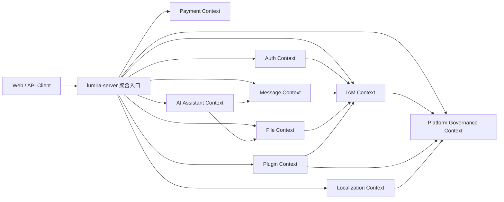

# Lumira DDD 架构迁移设计

## 1. 背景

Lumira 当前采用模块化单体优先的后端形态：`services/lumira-server` 聚合启动，`services/*-service` 保留未来拆分边界。这一点和 DDD 的战略设计方向是一致的：先建立清晰的业务边界，再决定是否物理拆分服务。

本设计不主张一次性大规模改包名或拆微服务。目标是把现有“模块边界”进一步升级为“领域边界”，让核心业务规则沉入领域模型，应用服务只编排用例，基础设施只处理技术实现。

参考资料：

- Microsoft Learn: Designing a DDD-oriented microservice, https://learn.microsoft.com/en-us/dotnet/architecture/microservices/microservice-ddd-cqrs-patterns/ddd-oriented-microservice
- Microsoft Azure Architecture Center: Use domain analysis to model microservices, https://learn.microsoft.com/en-us/azure/architecture/microservices/model/domain-analysis
- Microsoft Azure Architecture Center: Use tactical DDD to design microservices, https://learn.microsoft.com/en-us/azure/architecture/microservices/model/tactical-domain-driven-design
- Martin Fowler: Bounded Context, https://martinfowler.com/bliki/BoundedContext.html
- Martin Fowler: Domain-Driven Design, https://martinfowler.com/bliki/DomainDrivenDesign.html

## 2. DDD 理解基线

DDD 分为战略设计和战术设计。

战略设计解决“系统边界怎么切”：

- `Domain`：系统要解决的业务问题域。
- `Subdomain`：业务问题的子域，可分为核心域、支撑域、通用域。
- `Bounded Context`：模型语义一致的边界。同一个词在不同上下文可以有不同含义。
- `Context Map`：上下文之间的关系，例如调用、事件、共享内核、防腐层。

战术设计解决“一个上下文内部怎么写代码”：

- `Entity`：有持续身份的对象，例如用户、角色、消息、插件版本。
- `Value Object`：用值表达概念，无独立身份，例如邮箱、手机号、权限编码、租户 ID。
- `Aggregate`：一致性边界。一次事务只应修改一个聚合或少量强相关聚合。
- `Aggregate Root`：聚合对外唯一入口。
- `Domain Service`：不自然属于单个实体、但仍是领域规则的服务。
- `Repository`：领域层定义的持久化抽象，基础设施层实现。
- `Application Service`：用例编排、事务、权限、审计、事件发布，不承载核心业务规则。
- `Domain Event`：领域事实，例如 `RolePermissionsChanged`、`MessageRead`、`PluginEnabled`。

## 3. Lumira 目标架构

### 3.1 总体原则

1. 保持模块化单体运行形态，先做领域内聚，不急于物理拆服务。
2. 每个 Maven service 模块对应一个或多个限界上下文，但上下文边界必须显式。
3. 领域层不能依赖 Spring MVC、MyBatis、Redis、HTTP、外部 SDK。
4. 应用服务负责事务和编排，Controller 不直接访问 Mapper。
5. 跨上下文写操作进入 owner 上下文，跨上下文读操作通过查询服务、契约 DTO、事件投影或缓存快照完成。
6. Entity 不直接作为接口返回；接口模型使用 Request/Response DTO 或 VO。
7. 新业务优先按 DDD 目标结构写；旧业务按风险分批迁移。

### 3.2 推荐包结构

每个限界上下文内部建议使用以下结构：

```text
com.lumira.<service>.<context>
├── interfaces
│   ├── rest
│   └── assembler
├── application
│   ├── command
│   ├── query
│   ├── dto
│   └── service
├── domain
│   ├── model
│   ├── repository
│   ├── service
│   ├── event
│   └── valueobject
└── infrastructure
    ├── persistence
    ├── cache
    ├── client
    └── messaging
```

职责约束：

| 层 | 当前常见目录 | 目标职责 |
| --- | --- | --- |
| `interfaces` | `controller`、部分 `vo/dto` | HTTP 接入、参数校验、响应转换 |
| `application` | `app`、部分 `service` | 用例编排、事务、权限、审计、领域事件发布 |
| `domain` | 少量现有 `domain`、部分业务 service | 聚合、领域规则、领域服务、领域事件、仓储接口 |
| `infrastructure` | `mapper`、`entity`、Redis/安全/外部集成 | MyBatis、SQL、缓存、外部接口、仓储实现 |

## 4. 限界上下文划分

### 4.1 建议上下文地图



### 4.2 上下文职责

| 上下文 | 当前位置 | 类型 | 主要模型 | 边界说明 |
| --- | --- | --- | --- | --- |
| Auth | `auth-service`、`system/auth` | 支撑域 | Session、LoginChallenge、SecondFactor、PasskeyCredential | 负责登录、令牌、会话、二次验证；不拥有用户主数据 |
| IAM | `system-service/modules/iam`、`user`、`system/user/role/permission/menu/department` | 核心域 | User、Role、Permission、Menu、Department、PermissionSnapshot | 平台权限和租户身份核心；其他上下文消费快照，不直接改 IAM 表 |
| Platform Governance | `system/config/dict/security/branding/agreement/watermark/floating/audit/monitor` | 支撑域 | Config、Dict、AuditLog、RuntimeAppearance | 平台配置、审计、运行视图；避免继续吸收独立业务 |
| Message | `message-service` | 支撑域 | Notice、ReadState、DeliveryLog、RealtimeTicket | 消息归档和实时投递；用户信息只保存摘要或引用 |
| File | `file-service` | 通用域 | FileObject、StorageSpace、UploadSession | 文件对象和存储策略；业务引用文件 ID，不跨域维护文件表 |
| Plugin | `plugin-service`、`system/plugin` | 支撑域 | Plugin、PluginVersion、TenantPlugin、RuntimePolicy | 插件包、版本、启用状态和运行策略；system 只保留展示投影 |
| Localization | `localization-service` | 支撑域 | Language、Namespace、TranslationEntry、Release | 国际化词条和发布版本 |
| Payment | `payment-service` | 支撑域 | PaymentOrder、Refund、ProviderConfig、WebhookEvent | 支付与回调，需和业务订单保持防腐层 |
| AI Assistant | `system-service/modules/ai` | 业务增强域 | Employee、Skill、LlmService、KnowledgeBase、Conversation | AI 数字员工和知识库，可作为后续独立服务候选 |

## 5. 关键聚合设计

### 5.1 IAM 上下文

聚合建议：

- `User`：用户主资料、状态、安全资料引用。
- `Role`：角色基础信息、权限集合、数据范围。
- `Department`：组织树和组织状态。
- `PermissionSnapshot`：用户在租户内的权限结果，作为读模型和缓存模型。

领域事件：

- `UserStatusChanged`
- `UserDepartmentChanged`
- `RolePermissionsChanged`
- `DepartmentTreeChanged`
- `PermissionSnapshotInvalidated`

约束：

- 角色权限变更必须由 `Role` 聚合完成，不能散落在 Controller 或 Mapper。
- 权限快照失效应是领域事实，缓存清理和 session 刷新是事件处理结果。

### 5.2 Auth 上下文

聚合建议：

- `AuthSession`：会话状态、当前租户、权限摘要、最后活跃时间。
- `LoginChallenge`：验证码、加密登录挑战、二次验证挑战。
- `PasskeyCredential`：用户 Passkey 凭证。

领域事件：

- `LoginSucceeded`
- `LoginFailed`
- `SessionRefreshed`
- `SessionRevoked`
- `SecondFactorVerified`

约束：

- Auth 可以读取 IAM 的用户摘要和权限快照，但不能写用户主表。
- Session 内的用户快照必须有版本或失效机制。
- `AuthSessionStore` 负责 Redis session payload、在线索引和命中/未命中/保存/移除/损坏 payload 指标；对齐版本失败会计入 `auth.bootstrap_cache.alignment_rejects`；当前用户热路径优先使用已嵌入 session 的用户与权限快照。

### 5.3 Message 上下文

聚合建议：

- `Notice`：消息内容、目标、状态、可见性。
- `NoticeReadState`：用户阅读状态。
- `DeliveryLog`：投递记录。

领域事件：

- `NoticeCreated`
- `NoticeRead`
- `NoticeArchived`
- `NoticeDelivered`

约束：

- 消息列表是查询模型，不应强制通过写聚合加载完整对象。
- 未读数可以是投影或缓存，不应依赖全表 count。

### 5.4 Plugin 上下文

聚合建议：

- `PluginDefinition`：插件标识、基础信息、能力声明。
- `PluginVersion`：版本包、manifest、schema、发布状态。
- `TenantPlugin`：租户启用、禁用、运行策略。

领域事件：

- `PluginUploaded`
- `PluginVersionPublished`
- `TenantPluginEnabled`
- `TenantPluginDisabled`
- `PluginSchemaChanged`

约束：

- `system-service` 只消费插件菜单/权限视图，不承担插件生命周期主流程。
- 插件运行时安全策略属于 Plugin 上下文。

### 5.5 AI Assistant 上下文

聚合建议：

- `AiEmployee`：数字员工身份、启用状态、技能绑定。
- `LlmService`：模型供应商、密钥引用、可用状态。
- `KnowledgeBase`：知识库、文档引用、索引状态。
- `Conversation`：会话、消息、工具调用记录。

领域事件：

- `AiEmployeePublished`
- `KnowledgeDocumentAdded`
- `KnowledgeIndexRequested`
- `ConversationMessageAppended`

约束：

- 文件原文归 File 上下文，AI 只保存文件引用和索引状态。
- 长任务通过事件或 job 编排，不在 HTTP 请求内完成重处理。

## 6. 迁移路线

### 阶段 0：冻结边界和命名

目标：

- 新增 DDD 架构文档和 ADR。
- 明确后续新代码必须遵守目标包结构。
- 禁止新增 Controller 直接调用 Mapper。

交付物：

- 本文档。
- ADR：采用 DDD 模块化单体架构。
- 架构检查清单。

### 阶段 1：建立公共 DDD 基础

目标：

- 在 `libs/common-domain` 补齐轻量抽象：`DomainEvent`、`AggregateRoot`、`ValueObject`、`Repository` 标记接口。
- 建立领域事件发布适配到现有 Outbox 的桥接。
- 建立 ArchUnit 或等价测试，约束依赖方向。

注意：

- 公共库只放抽象，不放业务模型。
- 不引入重型 DDD 框架，避免把复杂度转嫁给团队。

### 阶段 2：选择 IAM 作为样板上下文

原因：

- IAM 是当前性能和权限正确性的核心。
- 已经存在 `iam`、`user`、`role`、`permission` 等边界，但散在 `system` 下。
- 聚合、事件和缓存失效的收益明显。

目标结构示例：

```text
com.lumira.saas.modules.iam
├── interfaces
│   └── rest
├── application
│   ├── command
│   ├── query
│   └── service
├── domain
│   ├── model
│   │   ├── User.java
│   │   ├── Role.java
│   │   └── PermissionSnapshot.java
│   ├── repository
│   ├── service
│   ├── event
│   └── valueobject
└── infrastructure
    ├── persistence
    └── cache
```

迁移步骤：

1. 保留现有接口路径不变。
2. 先抽 `Role`、`PermissionSnapshot` 两个聚合。
3. 将权限变更、角色变更、用户组织变更统一发出领域事件。
4. 将 Redis 失效、session payload 刷新改为事件处理器。
5. 补领域单测和应用服务集成测试。

### 阶段 3：迁移 Message、Plugin、File 等低耦合上下文

优先顺序：

1. `message-service`：边界清晰，读写模型容易区分。
2. `file-service`：典型资源域，聚合简单。
3. `plugin-service`：生命周期规则复杂，但 owner 明确。
4. `localization-service`：发布版本适合聚合建模。
5. `payment-service`：在正式业务支付扩展前先建好防腐层。

### 阶段 4：拆解过宽的 Platform/System 上下文

`system-service/modules/system` 当前包容了太多子能力，建议拆成内部上下文：

- `platform-settings`：配置、品牌、协议、水印、浮窗、安全设置、SMTP、验证码设置。
- `platform-audit`：登录审计、操作审计、敏感操作记录。
- `platform-monitoring`：运行监控、在线会话、仪表盘。
- `platform-catalog`：菜单展示、路由目录、插件展示投影。

这一步只调整代码内聚，不改变 API 路径。

### 阶段 5：按上下文评估物理拆分

只有当上下文满足以下条件时才拆独立服务：

- owner 表清晰。
- 外部调用只通过契约或事件。
- 有独立扩缩容或发布需求。
- 故障隔离收益大于部署复杂度。
- 已有健康检查、观测、回滚和数据迁移方案。

## 7. 依赖规则

允许：

```text
interfaces -> application -> domain
application -> domain
infrastructure -> domain
infrastructure -> application ports
```

禁止：

```text
domain -> infrastructure
domain -> Spring MVC / MyBatis / Redis
controller -> mapper
other context -> mapper/entity of owner context
common-* -> services/*
```

跨上下文集成方式优先级：

1. 同进程应用服务接口或 `libs/lumira-api` 契约。
2. 领域事件 + Outbox + 投影。
3. 查询快照或缓存。
4. 防腐层适配外部或遗留模型。

## 8. 和性能优化的关系

DDD 不直接等于性能优化，但可以减少性能问题的结构性来源：

- 聚合和 owner 清晰后，缓存失效点更少、更准确。
- 查询模型和写模型分离后，列表和仪表盘不必加载完整聚合。
- 跨上下文通过事件投影后，热点接口不再临时 join 多个 owner 表。
- 应用服务编排收敛后，更容易定位慢请求来自哪一个用例。

因此，当前刚完成的 bootstrap 聚合、权限快照、消息查询优化应保留，并在 DDD 迁移中固化为领域规则和查询模型。

## 9. 风险与缓解

| 风险 | 影响 | 缓解 |
| --- | --- | --- |
| 一次性重构过大 | 回归范围失控 | 只按上下文逐步迁移，接口路径保持不变 |
| DDD 只改目录不改逻辑 | 复杂度没有下降 | 每次迁移必须抽出聚合规则和领域事件 |
| 领域模型过度纯化 | 开发效率下降 | 保持轻量 DDD，不引入复杂框架 |
| 跨上下文调用变慢 | 性能回退 | 高频读走投影/缓存，写走 owner |
| 团队理解不一致 | 新旧风格混杂 | 增加样板上下文、代码模板和架构测试 |

## 10. 验收标准

一个上下文完成 DDD 迁移，应满足：

1. 对外 API 路径和响应兼容。
2. Controller 不直接访问 Mapper。
3. 核心业务规则在领域模型或领域服务中。
4. 应用服务负责事务、权限、审计、事件发布。
5. 基础设施实现仓储、缓存、外部集成。
6. 跨上下文访问不依赖对方 Mapper 或 Entity。
7. 有领域单测、应用服务测试和关键接口回归测试。
8. 有至少一个领域事件或明确说明该上下文暂不需要事件。

## 11. 建议下一步

1. 评审并接受 ADR。
2. 在 `common-domain` 建立轻量 DDD 基础抽象。
3. 为依赖方向增加架构测试。
4. 以 IAM 的 `Role`、`PermissionSnapshot` 为第一批样板聚合。
5. 迁移完成一个上下文后，再推进 Message 或 File。

## 12. 当前落地进度

已完成的工程基座：

- `libs/common-domain`：`AggregateRoot`、`EntityId`、`ValueObject`、`DomainEvent`、`DomainEventPublisher`、`Repository`、`Specification`、`PageQuery`、`ReadModel`、`VersionedReadModel`。
- `libs/lumira-api`：跨上下文事件和分页/读模型版本 DTO。
- 后端模块统一引入 `common-domain`，新增 DDD 架构护栏，扫描全部 `domain/model`、`domain/event`、`domain/repository`、`domain/valueobject`，禁止 Spring、MyBatis、Redis、HTTP client、Mapper 等技术依赖进入领域层。
- 新增 `docs/27-ddd-owner-table-manifest.csv`，并在 `DddArchitectureBoundaryTest` 中校验每个限界上下文的 owner 表声明、DDL 迁移写入归属、MyBatis XML/JdbcTemplate 显式写路径归属、`BaseMapper` 写方法归属、`BaseMapper` 表管理归属、Controller 不直连 Mapper、历史 compatible writer、split-target 模块不得 import 其他上下文 `Entity`/`Mapper`、独立 owner service 不得通过 Maven 依赖其他 service artifact，以及 `job-executor` 这类 adapter 不拥有业务表。
- `/api/v2/architecture/contexts` 输出当前限界上下文目录，作为前端/运维/拆分评审入口，并已补 v2 契约测试覆盖上下文清单、缓存键和核心不变量。
- `/api/v2/auth` 已提供登录密钥、登录、刷新 token、当前用户、登出、keepalive 的 v2 adapter，保持 v1 兼容窗口，同时通过契约测试确保 v2 只委托 `AuthAppService`，不绕过 session payload 和权限快照热路径；`/api/v2/auth/readiness|health|metrics` 已暴露 Auth owner 拆分门禁和 session store hit/miss/save/remove/corrupt payload、`auth.bootstrap_cache.alignment_rejects` 实时指标。
- `/api/v2/message` 已提供消息主列表、归档、未读数、全读的 v2 adapter，保持 v1 兼容窗口，同时通过契约测试确保 v2 只委托 `MessageAppService`。
- `/api/v2/plugins` 已提供插件定义、版本、状态、启停、当前租户 available/bootstrap/menus/permissions 和 runtime security policy 的 v2 adapter，管理写路径继续委托 `PluginManagementAppService`，bootstrap 读取使用当前租户和权限快照输入；`/api/v2/plugins/readiness|health|metrics` 已暴露 Plugin owner 拆分门禁和 outbox backlog 实时指标。
- `/api/v2/payment` 已提供支付通道设置、订单、退款和 webhook 的 v2 adapter；`/api/v2/payment/readiness|health|metrics` 已暴露 Payment owner 拆分门禁和 outbox pending/failed/dead-letter/dispatchable 实时指标，内部 job 已支持 relay 和按 outbox id replay。
- `/api/v2/localization` 已提供 runtime bundle、语言、命名空间、词条分页、发布列表、发布、回滚、同步等 v2 adapter；runtime bundle 保持公开高频读路径并复用发布版缓存，管理写路径通过契约测试确保只委托 `LocalizationManagementAppService`；`/api/v2/localization/readiness|health|metrics` 已暴露 Localization owner 拆分门禁和 runtime bundle cache size/hit/miss/hit-ratio 实时指标。
- `/api/v2/payment` 已提供支付通道设置、订单、退款和 webhook 的 v2 adapter；设置入口继续限定超级管理员，订单/退款使用权限快照校验，webhook 保持公开回调边界并委托 `PaymentWebhookService` 执行签名、幂等和状态流转。
- `/api/v2/ai` 已提供员工/助手、会话、聊天、知识库、知识库文档上传/重建索引/检索、native tool 执行与编排确认等 v2 adapter；聊天热路径和知识库异步索引路径通过契约测试确保只委托 AI application service，不直接访问 owner 表；`/api/v2/ai/readiness|health|metrics` 已暴露 AI owner 拆分门禁和知识库索引 pending/retryable/failed/dead-letter、vector/local-hashing chunk 实时指标。
- `/api/v2/files` 已提供文件列表、详情、预览、下载、上传、删除、存储空间管理和连通性测试的 v2 adapter，继续委托 `FileManagementAppService`，保留 v1 兼容窗口。
- `/api/v2/platform` 已提供公开 bootstrap、配置、字典、runtime appearance、品牌、协议、水印、悬浮窗、安全、SMTP、微信公众号通知配置的 v2 adapter，继续委托 Platform/System application service，保留 v1 兼容窗口。
- `/api/v2/iam` 已提供租户读写生命周期、用户、用户导出、角色、权限、菜单、部门的 v2 adapter，继续委托 IAM/System application service，保留 v1 兼容窗口；租户写侧已通过 `IamTenantCommandService` 收口创建、更新、状态、归档和成员默认关系，并通过 `V17__iam_tenant_v2_permissions.sql` seed 管理权限。
- `/api/v2/iam/readiness`、`/api/v2/auth/readiness`、`/api/v2/platform/readiness`、`/api/v2/files/readiness`、`/api/v2/message/readiness`、`/api/v2/plugins/readiness`、`/api/v2/payment/readiness`、`/api/v2/localization/readiness`、`/api/v2/ai/readiness`、`/api/v2/job/readiness` 已提供拆分门禁观测契约，暴露 owner 表、API 契约、事件/读模型、健康检查、指标、依赖、回滚步骤和当前阻塞项。
- `/api/v2/iam/health|metrics`、`/api/v2/auth/health|metrics`、`/api/v2/platform/health|metrics`、`/api/v2/files/health|metrics`、`/api/v2/message/health|metrics`、`/api/v2/plugins/health|metrics`、`/api/v2/payment/health|metrics`、`/api/v2/localization/health|metrics`、`/api/v2/ai/health|metrics`、`/api/v2/job/health|metrics` 已提供 owner 级观测契约，返回拆分前自检项和 Prometheus/Micrometer 指标口径；IAM/Platform metrics 已接入 read-model 当前版本值，Auth metrics 已接入 session store hit/miss/save/remove/corrupt payload 与 `auth.bootstrap_cache.alignment_rejects` 实时值，File metrics 已接入 outbox 当前 recorded/failed/dead-letter 计数，Message metrics 已接入 dispatchable outbox backlog 实时值，Plugin/Payment metrics 已接入 pending/failed/dead-letter/dispatchable outbox backlog 实时值，Localization metrics 已接入 runtime bundle cache size/hit/miss/hit-ratio 实时值，AI metrics 已接入知识库索引 pending/retryable/failed/dead-letter 和 vector/local-hashing chunk 实时值，Job metrics 已接入 BackendJobClient target/internal token/handler declaration 配置值。
- `V13__ddd_read_model_versions.sql` 建立读模型版本登记表，为 `tenantId + version + scope` 缓存键和事件失效做准备。
- `scripts/ddd-performance-smoke.mjs` 固化 DDD 迁移后的热路径验收入口。
- `docs/32-ddd-performance-scenarios.example.json` 提供登录、bootstrap、权限、消息、语言包、插件、文件、支付 webhook、AI chat 等热路径场景模板；`scripts/ddd-performance-smoke.mjs` 支持用 `DDD_SMOKE_SCENARIOS_FILE` 执行 GET/POST/body 场景并与 baseline 比较。
- `docs/28-ddd-hot-path-explain-plan.md` 记录热路径 SQL、owner、索引和 `EXPLAIN` 模板，作为跨 owner 查询和索引验收清单。
- `docs/29-ddd-physical-split-readiness.md` 输出 IAM、Auth、Platform、Message、File、Plugin、Localization、Payment、AI、Job 的物理拆分清单，覆盖 owner 表、API、事件/读模型、配置、健康检查、观测指标、回滚方案和拆分阻塞项。
- `docs/31-ddd-operational-runbook.md` 输出 DDD 运行演练手册，覆盖 readiness/health/metrics 采集、outbox relay/dead-letter/replay、性能 baseline、EXPLAIN 产物、回滚证据和最终验收清单。
- `docs/33-ddd-completion-audit.md` 记录当前代码级完成证据和仍需真实环境证明的项目，避免把未执行的性能、EXPLAIN、E2E 和回滚演练误判为完成。
- `.github/workflows/ci.yml` 已接入 DDD 架构/性能门禁：单独运行架构边界测试、`ddd-performance-smoke` 语法检查和 `ddd-explain-gate` 热点 SQL 清单/执行计划校验。
- `scripts/ddd-readiness-gate.mjs` 已接入 CI，校验十个上下文的 readiness controller、契约测试、文档端点和运行手册演练入口，避免拆分观测契约回退。

已接入领域模型的上下文：

- IAM：`RoleAggregate`、`UserAggregate`、`PermissionSnapshotReadModel`，角色权限变更发布领域事件并失效权限快照；权限快照版本已接入 `ddd_read_model_version`，`/api/v2/iam/metrics` 已暴露 `iam.permission_snapshot.current_version` 的实时读模型版本值。
- Auth：`AuthSessionAggregate`，刷新和登出路径显式表达 session touch/revoke 规则；`AuthSessionStore` 已提供 session payload 的 hit/miss/save/remove/corrupt payload 和 `auth.bootstrap_cache.alignment_rejects` 指标，支撑 current-user/session bootstrap 热路径观测。
- Platform：`ConfigAggregate`、`RuntimeAppearanceReadModel`，配置/外观快照具备版本化读模型锚点；品牌、水印、悬浮窗变更已写入 `ddd_read_model_version` 的 `platform/runtime-appearance` 版本登记，支持 `tenantId + version + scope` 热缓存键失效；`/api/v2/platform/metrics` 已暴露 `platform.runtime_appearance.current_version` 的实时读模型版本值。
- Message：`NoticeAggregate`、`NoticeListItemReadModel`，已读/撤回路径经过领域模型；未读数和归档列表总量查询已改为 capped count，避免高频无界统计；操作审计通过 `SystemInternalApi.recordOperationAudit` 上报平台审计 owner，不再直写 `audit_operation_log`；SMTP/微信公众号配置和收件人解析通过 System/IAM owner API 获取，不再复制 `sys_config/sys_user/sys_user_tenant/sys_user_role` Mapper；消息列表目标用户/角色展示字段通过 `usersByIds`、`rolesByIds` 批量只读快照补全，主列表 SQL 不再联 `sys_user/sys_user_tenant/sys_role`；可见性判断使用 IAM 权限快照 roleIds 输入，不再在 Message SQL 中查询 `sys_user_role`；归档查询对象携带权限快照版本，`markAllRead` 复用同一次快照输入计算未读数，避免一次用例内重复拉取权限快照；`/api/v2/message/readiness|health|metrics` 已暴露 owner 表、outbox relay/replay、WebSocket、capped unread 查询和 dispatchable backlog 指标。
- File：`FileObjectAggregate`、`StorageSpace`，上传/删除事件通过 file outbox adapter 发布；File owner 已提供 outbox relay/replay、logging dispatcher 和内部 job 接口，`fileOutboxRelayJob` 只调用 File owner API，不读取文件业务表；上传成功后会幂等生成 `file_processing_task`，并发布 `FileProcessingTaskRequested`，处理任务支持批量 claim、失败重试、指数退避和 `DEAD_LETTER`；处理产物落 `file_processing_artifact`，为安全、AI_PARSE、预览和检索提供 owner 输出；`FileInternalApi.readProcessingArtifactForUser` 已作为跨上下文只读契约暴露 File owner 处理产物，AI owner 索引 job 优先消费 `TEXT_CONTENT` artifact，缺失时才回退读取原文件并自行解析；`/file/internal/jobs/processing/run` 已作为 owner 内部执行入口接入 `fileProcessingTaskJob`，Job 只触发 File owner API；安全扫描处理器已落地为可插拔引擎，默认 `LUMIRA_INLINE_RULES` 内置 EICAR 测试签名和高风险扩展规则，也可通过 `lumira.file.security-scan.mode=CLAMAV` 切换到 ClamAV `INSTREAM` 外部扫描 adapter；扫描结果写入 `SECURITY_SCAN_RESULT` artifact，命中威胁时将文件置为 `QUARANTINED`，高风险扩展在无威胁时进入 `REVIEW_REQUIRED`；图片缩略图处理器已写入 `THUMBNAIL_RESULT` artifact，本地存储生成 `.thumb.jpg` 并标记 `GENERATED`，远程对象存储标记 `DEFERRED_REMOTE_STORAGE`，避免异步任务无意义失败并为 provider-native 缩略图接入保留契约；图片 OCR 已接入异步处理任务和可插拔引擎，默认 `DISABLED` 写入 `OCR_RESULT/SKIPPED` 并使任务成功，生产可通过 `lumira.file.ocr.mode=TESSERACT` 调用外部 Tesseract CLI，抽取到文本时同步写入 `TEXT_CONTENT` artifact；本地 txt/md/csv/json/log 文本抽取已落地，会写入 `TEXT_CONTENT` artifact；PDF/Word/Excel/PPT 抽取已接入 Tika，同样通过异步任务写入 `TEXT_CONTENT` artifact；File owner 的 AI_PARSE 准备阶段已消费 `TEXT_CONTENT` 并生成 `AI_PARSE_READY` artifact；`/api/v2/files/metrics` 已暴露 outbox recorded/failed/dead-letter 和 processing pending/failed/dead-letter 的实时 owner 读模型值。
- Plugin：`TenantPluginAggregate`、`PluginManifestReadModel`，启停事件已写入标准 `plugin_event_outbox`，运行日志保留为审计投影；插件权限注册已通过 `SystemInternalApi.registerPluginPermissions` 收口到 IAM owner 写入，不再由 plugin mapper 直写 `sys_permission/sys_role_permission`；Plugin owner 已提供 outbox relay/replay，支持 claim、指数退避、`DEAD_LETTER` 死信标记，并由 `pluginOutboxRelayJob` 作为纯 adapter 调用；租户插件启用、停用、版本切换、回滚、卸载会推进 `plugin/bootstrap` 读模型版本，支持插件启动投影缓存失效；`/api/v2/plugins/metrics` 已暴露 pending/failed/dead-letter/dispatchable outbox backlog 实时值。
- Localization：`ReleaseAggregate`、`BundleReadModel`，发布/回滚路径具备发布版 bundle 和领域语义；runtime bundle 已按 `locale + releaseVersion` 缓存，并会在读取到新的 active release version 时清理同 locale 旧版本缓存，覆盖跨实例发布后的本地缓存失效；`/api/v2/localization/metrics` 已暴露 runtime bundle cache size、hit、miss 和 hit ratio 实时值。
- Payment：`PaymentOrderAggregate`、`WebhookEvent`，订单创建/支付成功领域事件写入 `payment_event_outbox`，webhook 幂等测试覆盖重复事件不二次流转，签名失败和 nonce 重放拒绝路径已纳入回归测试；Payment owner 已提供 outbox relay/replay，支持 claim、指数退避和 `DEAD_LETTER` 死信标记，relay enabled/batch/replay 委托已纳入契约测试；`/api/v2/payment/metrics` 已暴露 pending/failed/dead-letter/dispatchable outbox backlog 实时值。
- AI：`KnowledgeBaseAggregate`、`ConversationMessage`，上传/重建索引只落文件、文档记录和 `AI_KNOWLEDGE_INDEX_REQUESTED`，文本提取、chunk 重建和本地 embedding 投影已迁入 owner job；`AiKnowledgeVectorService` 已提供本地 `local-hashing-v1` embedding adapter，索引时写入 `ai_knowledge_chunk.embedding_model|embedding_dim|embedding_vector_json|vector_indexed_at`，检索时先按 owner 权限获取 bounded candidates，再按向量相似度和词项命中混合重排；AI 知识库索引任务已增加 `index_retry_count`、`index_next_retry_at`、`index_last_error` 治理字段，job 支持到期失败任务重试、指数退避、成功后清理失败信息、超过阈值进入 `DEAD_LETTER`；AI native tool runtime 的菜单、平台配置通过 `AiPlatformQueryFacade` 隔离，用户搜索通过 `AiIamQueryFacade` 隔离，runtime 本身不再直接拼接 IAM/Platform owner 表 SQL；头像文件解析、文件搜索和会话附件快照通过 `FileInternalApi` 进入 File owner，不再直接查询 `file_object`；`/api/v2/ai/metrics` 已暴露索引 backlog、dead-letter 和 vector projection 当前值。
- Job：`RelayTaskReadModel`，XXL-JOB handler 只描述 owner relay/processing task 并调用 owner 后端接口；新增 AI 知识库索引 job 和 File processing task job，均不读取业务 owner 表；`/api/v2/job/readiness|health|metrics` 已明确 Job 无 owner 表、无业务事件，只暴露 adapter handler 和目标配置观测。

## 13. 下一阶段拆分清单

优先级 P1：

- 将 IAM/Platform 的 p95、缓存命中率、失败率等 Micrometer 运行指标和 File 剩余处理/存储指标接入真实数值与看板；File upload response、object storage operation、security scan、processing task 均已接入 Micrometer timer/counter；IAM permission snapshot p95/cache hit ratio/invalidation lag 与 Platform config/bootstrap p95、audit write failure rate、config cache hit ratio 已接入 Micrometer runtime metrics，Platform read-model version lag 已从 `ddd_read_model_version.rebuilt_at` 读取真实值，Platform 配置读取使用 `tenantId + version + keys` 的版本化快照缓存；`scripts/ddd-performance-smoke.mjs` 已支持 baseline/actual p95 回退门禁，`scripts/ddd-collect-explain.mjs` 已支持 MySQL `EXPLAIN FORMAT=JSON` 采集，下一步在真实 CI/发布环境提供 baseline、actual 和数据库连接；File 安全扫描已支持 inline 与 ClamAV 可插拔引擎，图片 OCR 已支持 disabled/Tesseract 可插拔异步处理，远程对象缩略图已具备 deferred artifact 策略，AI owner 已具备本地 embedding/vector projection 与检索重排，IAM 租户读写生命周期和用户导出已补齐 v2 adapter，Platform 审计/monitoring 已补齐 v2 adapter，下一步补齐 ClamAV/Tesseract/provider-native thumbnail/外部 embedding 或 vector DB 的部署可用性和压测演练，并补齐 IAM/Platform 剩余运行看板和演练。

优先级 P2：

- 在具备真实数据库和调度环境后，补充跨服务 outbox relay 运行时演练：job-executor 触发、owner 服务 claim、dispatcher 投递、死信 replay 和审计可观测链路。
- 将性能脚本和 `EXPLAIN FORMAT=JSON` 采集接入 CI，核心热路径 p95 回退超过 10% 或热点 SQL 退化为全表扫描时失败。
