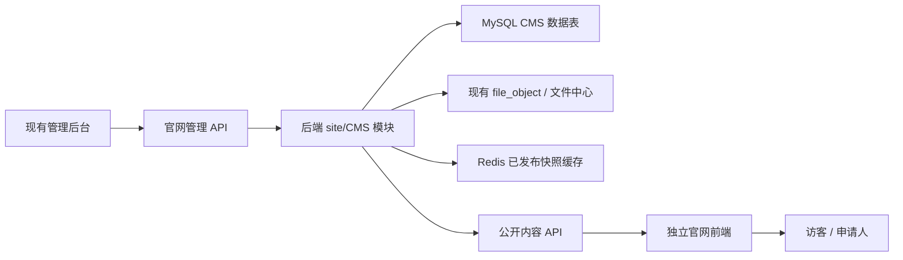

# 独立官网与 CMS 管理能力技术方案

> **执行说明：** 后续实现时请按本文任务顺序逐项执行，并在每个任务完成后进行验证。

**目标：** 建设一个独立于现有管理前端的官网前端，同时通过当前 SaaS 系统完成官网内容、导航、页面、表单和发布流程管理。

**架构：** 现有管理后台和后端继续作为管理控制面，在后端新增 `site` / CMS 业务域，并新增一个独立官网前端。官网前端只读取已发布内容的公开 API，可以独立部署、缓存和静态化渲染，不与现有管理端页面耦合。

**技术栈：** 现有管理端保持 React 19、TypeScript、Umi Max、Ant Design、ProComponents。现有后端保持 Java 21、Spring Boot、Spring Cloud Alibaba、MyBatis Plus、MySQL、Redis、Flyway、Spring Security、Sentinel。新增官网前端建议使用 Next.js App Router、TypeScript、React，并使用独立于 Ant Design Pro 的官网设计体系。

---

## 1. 方案结论

推荐采用下面的拓扑：



关键决策：

- 不让当前 Umi 管理端同时承担官网展示。
- 第一阶段不新建第二套后端。
- 不把官网写死成一个固定企业官网模板。
- 将官网抽象为 `站点 + 导航 + 页面 + 区块 + 内容 + 表单 + 提交记录 + 发布版本`。
- 第一阶段只支持一个正式官网也可以，但数据模型必须保留 `site_id` 和 `tenant_id`，为后续多站点、多域名、多租户官网预留空间。

## 2. 为什么适合当前项目

当前系统已有可复用基础：

- `sys_config` 已经承载平台配置和品牌配置。
- `file_object` 已经记录上传文件元数据。
- `tenant_domain` 已经具备域名绑定基础。
- 管理后台已经有路由、权限、菜单、请求、审计、设置页等基础模式。
- 后端已经存在 `/api/v1/public/**` 类型的公开配置接口。

当前系统缺少的能力：

- 独立的 CMS / 页面 / 内容数据模型。
- 发布快照模型。
- 独立官网前端。
- 官网设置、导航、页面、内容、表单、提交记录等管理页面。
- 面向 SEO 和公开访问场景设计的官网公开 API。

## 3. 推荐仓库结构

在仓库根目录新增官网前端：

```text
site-frontend/
  app/
  components/
  features/
  lib/
  public/
  package.json
  next.config.ts
```

现有管理端新增官网管理页面：

```text
frontend/src/pages/site/
  settings.tsx
  navigation.tsx
  pages.tsx
  contents.tsx
  forms.tsx
  submissions.tsx

frontend/src/services/site/
  index.ts
```

现有后端新增 `site` 模块：

```text
backend/src/main/java/com/legendary/invention/saas/modules/site/
  controller/
  app/
  domain/
  dto/
  vo/
  mapper/
```

数据库迁移继续放在：

```text
backend/src/main/resources/db/migration/
```

## 4. 领域模型设计

### 4.1 核心数据表

第一阶段建议新增以下数据表：

```sql
create table site_site (
  id bigint primary key,
  tenant_id bigint not null,
  code varchar(64) not null,
  name varchar(128) not null,
  primary_domain varchar(255) null,
  logo_file_id bigint null,
  favicon_file_id bigint null,
  theme_json json null,
  seo_json json null,
  status varchar(32) not null,
  created_at datetime not null,
  updated_at datetime not null,
  created_by bigint null,
  updated_by bigint null,
  is_deleted tinyint not null default 0,
  version bigint not null default 0,
  unique key uk_site_tenant_code (tenant_id, code, is_deleted),
  key idx_site_tenant_status (tenant_id, status, is_deleted)
);

create table site_navigation (
  id bigint primary key,
  tenant_id bigint not null,
  site_id bigint not null,
  parent_id bigint null,
  title varchar(128) not null,
  link_type varchar(32) not null,
  link_target varchar(512) not null,
  open_type varchar(32) not null,
  sort_order int not null default 0,
  status varchar(32) not null,
  created_at datetime not null,
  updated_at datetime not null,
  created_by bigint null,
  updated_by bigint null,
  is_deleted tinyint not null default 0,
  version bigint not null default 0,
  key idx_site_nav_tree (tenant_id, site_id, parent_id, sort_order, is_deleted)
);

create table site_page (
  id bigint primary key,
  tenant_id bigint not null,
  site_id bigint not null,
  title varchar(180) not null,
  slug varchar(255) not null,
  page_type varchar(32) not null,
  seo_json json null,
  current_draft_version bigint null,
  current_published_version bigint null,
  status varchar(32) not null,
  published_at datetime null,
  created_at datetime not null,
  updated_at datetime not null,
  created_by bigint null,
  updated_by bigint null,
  is_deleted tinyint not null default 0,
  version bigint not null default 0,
  unique key uk_site_page_slug (tenant_id, site_id, slug, is_deleted),
  key idx_site_page_status (tenant_id, site_id, status, is_deleted)
);

create table site_page_version (
  id bigint primary key,
  tenant_id bigint not null,
  site_id bigint not null,
  page_id bigint not null,
  version_no bigint not null,
  blocks_json json not null,
  snapshot_json json null,
  status varchar(32) not null,
  created_at datetime not null,
  created_by bigint null,
  unique key uk_page_version (tenant_id, page_id, version_no),
  key idx_page_version_status (tenant_id, page_id, status)
);

create table site_content_category (
  id bigint primary key,
  tenant_id bigint not null,
  site_id bigint not null,
  parent_id bigint null,
  code varchar(64) not null,
  name varchar(128) not null,
  sort_order int not null default 0,
  status varchar(32) not null,
  created_at datetime not null,
  updated_at datetime not null,
  created_by bigint null,
  updated_by bigint null,
  is_deleted tinyint not null default 0,
  version bigint not null default 0,
  unique key uk_content_category_code (tenant_id, site_id, code, is_deleted),
  key idx_content_category_tree (tenant_id, site_id, parent_id, sort_order, is_deleted)
);

create table site_content (
  id bigint primary key,
  tenant_id bigint not null,
  site_id bigint not null,
  category_id bigint null,
  title varchar(220) not null,
  slug varchar(255) not null,
  summary varchar(500) null,
  cover_file_id bigint null,
  body_type varchar(32) not null,
  body_text mediumtext null,
  body_json json null,
  seo_json json null,
  tags_json json null,
  status varchar(32) not null,
  published_at datetime null,
  created_at datetime not null,
  updated_at datetime not null,
  created_by bigint null,
  updated_by bigint null,
  is_deleted tinyint not null default 0,
  version bigint not null default 0,
  unique key uk_site_content_slug (tenant_id, site_id, slug, is_deleted),
  key idx_site_content_list (tenant_id, site_id, category_id, status, published_at, is_deleted)
);

create table site_form (
  id bigint primary key,
  tenant_id bigint not null,
  site_id bigint not null,
  code varchar(64) not null,
  name varchar(128) not null,
  submit_policy varchar(32) not null,
  schema_json json not null,
  notification_json json null,
  status varchar(32) not null,
  created_at datetime not null,
  updated_at datetime not null,
  created_by bigint null,
  updated_by bigint null,
  is_deleted tinyint not null default 0,
  version bigint not null default 0,
  unique key uk_site_form_code (tenant_id, site_id, code, is_deleted),
  key idx_site_form_status (tenant_id, site_id, status, is_deleted)
);

create table site_form_submission (
  id bigint primary key,
  tenant_id bigint not null,
  site_id bigint not null,
  form_id bigint not null,
  submitter_user_id bigint null,
  submitter_ip varchar(64) null,
  data_json json not null,
  attachment_file_ids_json json null,
  status varchar(32) not null,
  reviewed_by bigint null,
  reviewed_at datetime null,
  review_remark varchar(500) null,
  created_at datetime not null,
  updated_at datetime not null,
  is_deleted tinyint not null default 0,
  version bigint not null default 0,
  key idx_form_submission_list (tenant_id, site_id, form_id, status, created_at, is_deleted),
  key idx_form_submission_user (tenant_id, submitter_user_id, created_at, is_deleted)
);
```

### 4.2 状态枚举

建议使用明确的字符串状态：

- `site_site.status`: `ENABLED`, `DISABLED`
- `site_navigation.status`: `VISIBLE`, `HIDDEN`
- `site_page.status`: `DRAFT`, `PUBLISHED`, `OFFLINE`
- `site_page_version.status`: `DRAFT`, `PUBLISHED`, `ARCHIVED`
- `site_content.status`: `DRAFT`, `PUBLISHED`, `OFFLINE`
- `site_form.submit_policy`: `ANONYMOUS`, `LOGIN_REQUIRED`
- `site_form_submission.status`: `PENDING`, `APPROVED`, `REJECTED`, `ARCHIVED`

## 5. API 设计

### 5.1 公开 API

所有公开读取接口只能返回已发布、可见、未删除的数据。

```text
GET  /api/v1/public/site/runtime
GET  /api/v1/public/site/navigation
GET  /api/v1/public/site/pages/{slug}
GET  /api/v1/public/site/contents
GET  /api/v1/public/site/contents/{slug}
GET  /api/v1/public/site/forms/{code}
POST /api/v1/public/site/forms/{code}/submissions
```

`/runtime` 返回站点设置、主题变量、默认 SEO、Logo、Favicon、页脚和基础功能开关。

`/pages/{slug}` 返回已发布的页面版本快照：

```json
{
  "site": {
    "code": "main",
    "name": "示例官网"
  },
  "page": {
    "title": "首页",
    "slug": "/",
    "seo": {}
  },
  "blocks": [
    {
      "id": "hero",
      "type": "hero",
      "props": {
        "title": "平台名称",
        "subtitle": "核心价值说明",
        "imageFileId": 1001
      }
    }
  ]
}
```

### 5.2 管理 API

所有管理 API 都必须登录并受权限控制。

```text
GET    /api/v1/site/settings
PUT    /api/v1/site/settings

GET    /api/v1/site/navigation
POST   /api/v1/site/navigation
PUT    /api/v1/site/navigation/{id}
DELETE /api/v1/site/navigation/{id}

GET    /api/v1/site/pages
POST   /api/v1/site/pages
GET    /api/v1/site/pages/{id}
PUT    /api/v1/site/pages/{id}
POST   /api/v1/site/pages/{id}/publish
POST   /api/v1/site/pages/{id}/offline
DELETE /api/v1/site/pages/{id}

GET    /api/v1/site/contents
POST   /api/v1/site/contents
GET    /api/v1/site/contents/{id}
PUT    /api/v1/site/contents/{id}
POST   /api/v1/site/contents/{id}/publish
POST   /api/v1/site/contents/{id}/offline
DELETE /api/v1/site/contents/{id}

GET    /api/v1/site/forms
POST   /api/v1/site/forms
PUT    /api/v1/site/forms/{id}
DELETE /api/v1/site/forms/{id}
GET    /api/v1/site/forms/{id}/submissions
PUT    /api/v1/site/submissions/{id}/review
```

### 5.3 权限标识

新增菜单和权限标识：

```text
site
site:settings
site:navigation
site:page
site:page:create
site:page:update
site:page:publish
site:content
site:content:create
site:content:update
site:content:publish
site:form
site:submission
site:submission:review
```

## 6. 后端实施计划

### 任务 1：新增数据库迁移

**涉及文件：**

- 新建：`backend/src/main/resources/db/migration/VXX__create_site_cms_tables.sql`

**实施步骤：**

1. 按第 4 节新增官网 CMS 数据表。
2. 在 `sys_menu` 中初始化 `官网管理` 菜单。
3. 初始化第 5.3 节列出的权限标识。
4. 本地启动后端并执行 Flyway 迁移。
5. 确认数据表、菜单和权限初始化成功。

**验证命令：**

```bash
mvn -pl backend spring-boot:run
```

预期结果：Flyway 可以正常执行新增迁移，没有校验和、SQL 语法或表结构错误。

### 任务 2：新增后端 DTO、VO 和枚举

**涉及文件：**

- 新建：`backend/src/main/java/com/legendary/invention/saas/modules/site/dto/SiteDTO.java`
- 新建：`backend/src/main/java/com/legendary/invention/saas/modules/site/vo/SiteVO.java`
- 新建：`backend/src/main/java/com/legendary/invention/saas/modules/site/domain/SiteEnums.java`

**实施步骤：**

1. 定义站点设置、导航、页面、内容、表单、审核操作相关请求 DTO。
2. 区分管理端 VO 和公开端 VO。
3. 使用 Jakarta Validation 校验必填字段。
4. `blocksJson`、`schemaJson`、`seoJson` 在接口边界要做结构约束，避免任意字符串直接入库。

**验证命令：**

```bash
mvn -pl backend -DskipTests compile
```

预期结果：后端可以编译通过。

### 任务 3：新增后端应用服务和 Mapper

**涉及文件：**

- 新建：`backend/src/main/java/com/legendary/invention/saas/modules/site/app/SiteManagementAppService.java`
- 新建：`backend/src/main/java/com/legendary/invention/saas/modules/site/app/PublicSiteAppService.java`
- 新建：`backend/src/main/java/com/legendary/invention/saas/modules/site/mapper/SiteMapper.java`

**实施步骤：**

1. 实现管理端 CRUD，所有查询都要带租户条件。
2. 实现发布操作，发布时生成不可变的公开版本快照。
3. 实现公开查询，只读取已发布版本。
4. 复用现有文件中心，将 `file_object` 的文件 ID 解析为公开可访问 URL。
5. 为公开运行时、导航、页面详情、内容详情增加 Redis 缓存。
6. 在发布、下线、导航更新、站点设置更新、内容发布时清理相关缓存。

**验证命令：**

```bash
mvn -pl backend -DskipTests compile
```

预期结果：后端可以编译通过。

### 任务 4：新增后端 Controller

**涉及文件：**

- 新建：`backend/src/main/java/com/legendary/invention/saas/modules/site/controller/SiteController.java`
- 新建：`backend/src/main/java/com/legendary/invention/saas/modules/site/controller/PublicSiteController.java`

**实施步骤：**

1. 管理接口统一放在 `/api/v1/site`。
2. 公开接口统一放在 `/api/v1/public/site`。
3. 管理接口添加后端权限校验。
4. 公开表单提交需要支持验证码、限流、防重复提交、登录要求判断。
5. 高频公开读取接口增加 Sentinel 资源标识。

**验证命令：**

```bash
mvn -pl backend test
```

预期结果：测试通过。若存在与本次无关的历史失败，需要记录失败项后再继续。

## 7. 管理端实施计划

### 任务 5：新增官网管理接口客户端

**涉及文件：**

- 新建：`frontend/src/services/site/index.ts`

**实施步骤：**

1. 为所有官网管理 API 增加类型化请求方法。
2. 复用 `frontend/src/services/common/request.ts`。
3. API 地址继续保持环境变量驱动，不写死后端域名。

**验证命令：**

```bash
corepack pnpm --dir frontend typecheck
```

预期结果：TypeScript 校验通过。

### 任务 6：新增管理端路由与菜单

**涉及文件：**

- 修改：`frontend/src/routes/meta.ts`
- 新增页面目录：`frontend/src/pages/site/`

**实施步骤：**

1. 根据产品决策，将 `官网管理` 作为一级菜单，或放在设置模块下。
2. 增加站点设置、导航管理、页面管理、内容管理、表单管理、提交记录路由。
3. 保持现有动态菜单和权限裁剪能力不变。
4. 前端路由 access key 与后端初始化权限保持一致。

**验证命令：**

```bash
corepack pnpm --dir frontend typecheck
```

预期结果：路由元信息和权限标识编译通过。

### 任务 7：建设官网管理页面

**涉及文件：**

- 新建：`frontend/src/pages/site/settings.tsx`
- 新建：`frontend/src/pages/site/navigation.tsx`
- 新建：`frontend/src/pages/site/pages.tsx`
- 新建：`frontend/src/pages/site/contents.tsx`
- 新建：`frontend/src/pages/site/forms.tsx`
- 新建：`frontend/src/pages/site/submissions.tsx`

**实施步骤：**

1. 使用 Ant Design 和 ProComponents 实现中后台高密度工作流。
2. 页面和内容列表支持查询、状态筛选、发布、下线、详情抽屉。
3. 第一阶段页面编辑器先做 JSON 驱动的区块编辑，不做完整拖拽式低代码编辑器。
4. 表单配置支持受控字段类型：单行文本、多行文本、下拉选择、单选、多选、日期、上传。
5. 提交记录页面支持审核抽屉，完成通过和驳回流程。

**验证命令：**

```bash
corepack pnpm --dir frontend typecheck
corepack pnpm --dir frontend build
```

预期结果：管理端可以完成类型校验和构建。

## 8. 独立官网前端实施计划

### 任务 8：创建独立官网前端

**涉及文件：**

- 新建：`site-frontend/package.json`
- 新建：`site-frontend/next.config.ts`
- 新建：`site-frontend/app/layout.tsx`
- 新建：`site-frontend/app/page.tsx`
- 新建：`site-frontend/app/[...slug]/page.tsx`
- 新建：`site-frontend/lib/api.ts`
- 新建：`site-frontend/lib/blocks.ts`

**实施步骤：**

1. 使用 Next.js App Router 和 TypeScript。
2. 通过 `SITE_API_BASE_URL` 配置后端公开 API 地址。
3. 不在代码中写死后端域名。
4. 根据已发布页面快照渲染区块。
5. 官网设计与 Ant Design Pro 管理端解耦。

**验证命令：**

```bash
corepack pnpm --dir site-frontend install
corepack pnpm --dir site-frontend build
```

预期结果：官网前端可以正常构建。

### 任务 9：实现官网渲染和表单提交

**涉及文件：**

- 新建：`site-frontend/components/blocks/`
- 新建：`site-frontend/components/site-header.tsx`
- 新建：`site-frontend/components/site-footer.tsx`
- 新建：`site-frontend/components/public-form.tsx`

**实施步骤：**

1. 实现 `hero`、`richText`、`imageText`、`contentList`、`cta`、`form`、`downloadList` 区块渲染器。
2. 从 `/runtime` 和 `/navigation` 渲染导航和页脚。
3. 从页面和内容 SEO 字段生成元信息。
4. 表单提交调用公开表单提交 API。
5. 对 `LOGIN_REQUIRED` 表单，根据最终产品选择跳转到现有登录流程，或新增申请人登录页。

**验证命令：**

```bash
corepack pnpm --dir site-frontend build
```

预期结果：首页、嵌套路由页面、内容详情页和表单页面都可以构建渲染。

## 9. 发布与缓存策略

采用发布时快照模型：

- 草稿编辑更新 `site_page_version.status = DRAFT`。
- 发布时创建或提升一个版本为 `PUBLISHED`。
- 公开读取只使用 `current_published_version`。
- 页面区块以快照形式保存，避免编辑草稿影响线上展示。
- Redis key 必须包含环境、租户、站点和 slug。

推荐缓存 key：

```text
site:public:{tenantId}:{siteId}:runtime
site:public:{tenantId}:{siteId}:navigation
site:public:{tenantId}:{siteId}:page:{slug}
site:public:{tenantId}:{siteId}:content:{slug}
```

官网前端建议：

- 已发布页面优先使用静态渲染或 ISR。
- 个性化、登录态、提交表单流程使用动态渲染。
- 部署目标支持后，再接入发布后的按需重新验证。

## 10. 安全要求

- 公开 API 绝不能返回草稿内容。
- 公开 API 绝不能暴露内部用户 ID、审核人 ID、审计字段、权限标识和删除记录。
- 公开表单提交必须有接口限流、验证码、防重复提交、上传类型限制和上传大小限制。
- 管理 API 必须依赖后端权限校验，前端权限隐藏只作为交互体验。
- 文件访问必须复用现有文件中心规则。官网公开素材可以公开访问，用户提交的私有附件必须受控访问。
- `blocksJson` 和 `schemaJson` 必须校验允许的区块类型和字段类型后再保存。

## 11. 部署策略

第一阶段推荐部署方式：

- 现有管理端继续部署在 Vercel。
- 后端继续使用当前服务器或容器部署链路。
- `site-frontend` 作为独立 Vercel 项目或独立 Vercel 应用部署。
- 在 Vercel 环境变量中配置 `SITE_API_BASE_URL`。
- 官网正式域名绑定到 `site-frontend`，不要绑定到管理后台。

后续演进：

- 官网流量变大后，公开内容 API 可以接入 CDN。
- 只有当 `site` 域出现独立扩容压力时，再拆成独立服务。
- 多站点或多租户官网成熟后，再接入 `tenant_domain` 做域名绑定。

## 12. 分阶段交付范围

### 第一阶段：CMS MVP

交付内容：

- 站点设置
- 导航管理
- 页面管理和区块 JSON 编辑
- 内容栏目和内容管理
- 表单管理和提交记录审核
- 公开 API
- 官网首页、页面、内容、表单渲染

暂不交付：

- 拖拽式可视化搭建器
- 模板市场
- 多站点租户控制台
- 复杂审批流

### 第二阶段：编辑体验增强

交付内容：

- 区块编辑器 UI
- 页面预览模式
- 草稿与已发布版本对比
- 可复用区块
- 定时发布

### 第三阶段：多站点平台

交付内容：

- 一个租户多个站点
- 域名绑定
- 主题预设
- 页面模板
- 必要时新增申请人或会员中心

## 13. 测试策略

后端测试：

- 公开 API 不返回草稿、下线、删除内容。
- 发布操作会创建不可变公开快照。
- 发布、下线、设置变更、导航变更后缓存会失效。
- 表单提交遵守匿名或登录后提交策略。
- 审核提交记录会正确更新状态和审核字段。

管理端测试：

- 官网管理 service 类型校验通过。
- 路由和权限元信息类型校验通过。
- 主要页面覆盖空态、加载态、成功态、错误态。

官网前端测试：

- 首页可以从 `/` 渲染。
- 动态 slug 页面可以正常渲染。
- 内容详情页可以生成 SEO 元信息。
- 表单提交可以处理前端校验和服务端错误。

冒烟验证命令：

```bash
mvn -pl backend test
corepack pnpm --dir frontend typecheck
corepack pnpm --dir frontend build
corepack pnpm --dir site-frontend build
```

## 14. 需要先确认的产品决策

实现前建议先确认：

1. `官网管理` 是一级菜单，还是放在 `设置` 模块下。
2. 第一阶段是否需要申请人账号中心，还是只需要公开表单提交。
3. 第一版官网内容形态是企业展示，还是企业展示 + 新闻资讯 + 申请表单。
4. 官网前端部署为独立 Vercel 项目，还是同团队下的独立应用。
5. 第一版是否需要域名绑定能力，还是只绑定一个固定官网域名。

## 15. 推荐实施顺序

建议顺序：

1. 数据库迁移和权限初始化。
2. 后端 DTO、VO、枚举。
3. 后端管理服务和公开服务。
4. 后端 Controller 和测试。
5. 管理端 service client。
6. 管理端页面。
7. 独立官网前端脚手架。
8. 官网页面渲染。
9. 发布、缓存、重新验证能力完善。
10. 部署和生产环境冒烟验证。

这个顺序可以先稳定数据契约，再做前端展示和交互。

## 16. 官方规范参考说明

- Next.js App Router 适合官网前端，因为它支持文件路由、React Server Components、布局和服务端/客户端组件边界。
- Next.js 静态渲染和 ISR 适合以发布内容为主的官网页面；涉及登录态或提交动作的流程应使用动态渲染。
- Spring Boot 缓存抽象可以配合 Redis 使用，但官网发布链路更重视一致性，所以缓存 key 和失效动作要显式设计。
