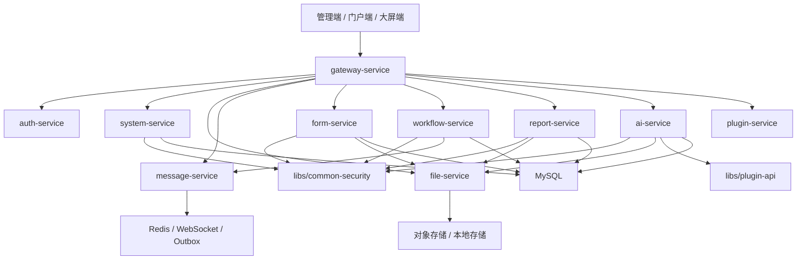

# 完整低代码 OA 报表大屏 AI 编排平台设计方案

> **执行说明：** 后续实现时按本文阶段推进。每个阶段都必须做到后端编译通过、前端 typecheck 通过、核心接口 smoke 通过，再进入下一阶段。

**目标：** 在当前微服务平台基础上，补齐通用数据权限、在线表单、流程设计、报表大屏、OA 办公、AI 知识库、模型管理和 AI 流程编排能力，形成可支撑大型业务系统的低代码平台。

**架构：** 不另起一套孤立系统，而是在现有 `gateway-service`、`system-service`、`file-service`、`message-service`、`plugin-service`、`libs/*`、`frontend`、`site-frontend` 基础上扩展平台能力。低代码、流程、报表、大屏和 AI 编排共享统一认证、统一权限、统一文件、统一消息、统一审计、统一数据权限和统一插件扩展模型。

**Tech Stack:** Java 21、Spring Boot 4 / 3.5 兼容设计、Spring Cloud Alibaba、Spring Cloud Gateway、MyBatis-Plus、MySQL、Redis、Flyway、Spring Security、Spring AI / Spring AI Alibaba、Vue/React 管理端兼容设计、Ant Design 组件体系、Vite/Umi 前端工程、Next.js 官网端。

---

## 1. 总体结论

目标能力可以拆成八个主平台域：

| 平台域 | 核心能力 | 推荐落点 |
| --- | --- | --- |
| 数据权限中心 | 组织、部门、角色数据范围、资源数据策略、查询过滤 | `libs/common-security`、`services/system-service` |
| 低代码表单中心 | 表单设计、字段模型、校验、提交、版本、发布 | 新增 `services/form-service` 或先落 `system-service/modules/form` |
| 流程/OA 中心 | 流程设计、审批流、待办、抄送、委托、催办 | 新增 `services/workflow-service`，复用现有 approval |
| 报表中心 | 数据集、指标、维度、筛选、图表、导出 | 新增 `services/report-service` |
| 大屏中心 | 大屏页面、组件编排、实时数据、发布展示 | `services/report-service` + `frontend` 大屏设计器 |
| AI 知识库中心 | 文档导入、切片、向量化、检索、RAG 问答 | 新增 `services/ai-service` 或扩展现有 AI 模块 |
| AI 编排中心 | AI 工作流、工具节点、模型节点、知识库节点、人工审批节点 | `services/ai-service` + `plugin-api` |
| 门户/官网中心 | 门户页面、内容、表单入口、公开提交 | 已有 `site-frontend` + CMS 能力继续演进 |

第一阶段不要追求所有功能“看起来都有”。最重要的是先把统一数据权限、表单、流程和报表的数据契约打稳。否则后面 OA、门户、AI 编排都会重复造字段、重复做状态、重复做权限。

## 2. 目标架构



服务拆分原则：

- `system-service` 继续承担用户、角色、权限、组织、审计、字典、配置等平台控制面。
- `form-service` 负责表单定义、字段定义、表单版本和表单提交。
- `workflow-service` 负责流程定义、流程实例、任务、审批、抄送、委托和 OA 工作台。
- `report-service` 负责数据集、报表、图表、大屏、导出。
- `ai-service` 负责模型供应商、模型配置、知识库、向量索引、RAG、AI 工作流。
- `plugin-service` 只做扩展安装、启停、运行时和插件声明，不承接主业务。
- `libs/common-*` 只沉淀跨服务公共能力，不放具体业务。

## 3. 能力边界

### 3.1 通用数据权限引擎

数据权限是整个计划的第一优先级。所有业务能力都必须基于它扩展。

目标能力：

- 支持 `ALL`、`TENANT`、`DEPT`、`DEPT_AND_CHILD`、`SELF`、`CUSTOM`。
- 支持资源级数据权限，例如 `file`、`user`、`form-submission`、`workflow-instance`、`report-dataset`、`ai-knowledge-document`。
- 支持角色多数据范围合并，默认取更宽授权，空规则默认降级为 `SELF`。
- 支持 MyBatis-Plus 查询和 JdbcTemplate 查询两条路径。
- 支持权限快照失效，角色数据范围变更后强制刷新登录态。

当前基础：

- `libs/common-security` 已有 `DataScopeType`、`DataPermissionRule`、`DataPermissionResolver`、`DataPermissionDecision` 雏形。
- `services/system-service` 已有 `sys_department`、`sys_user_department`、`sys_role_data_scope` 迁移雏形。

后续设计：

```text
CurrentUser
  userId
  tenantId
  roleIds
  primaryDeptId
  deptIds
  descendantDeptIds
  dataPermissionRules
  permissionKeys
```

资源字段标准：

| 字段 | 说明 |
| --- | --- |
| `tenant_id` | 租户边界，所有业务表必须有 |
| `created_by` | 创建人，支持本人数据 |
| `owner_user_id` | 负责人，支持业务归属 |
| `owner_dept_id` | 负责部门，支持部门数据 |
| `visibility_scope` | 公开性，支持草稿/私有/组织内/公开 |

强制规则：

- 前端按钮隐藏不等于数据权限。
- 后端列表接口必须走数据权限过滤。
- 详情接口必须做资源归属校验。
- 导出接口必须复用同一数据权限条件。
- 管理员 `ALL` 必须可审计，不允许静默跨租户。

### 3.2 在线表单设计器

表单中心是低代码平台的输入层。

目标能力：

- 表单定义、字段定义、字段分组、布局配置。
- 字段类型：文本、数字、金额、日期、日期范围、单选、多选、下拉、级联、附件、图片、富文本、子表、关联数据。
- 字段校验：必填、长度、正则、唯一性、数值范围、文件类型、文件大小、跨字段规则。
- 表单版本：草稿、发布、停用，提交记录绑定发布版本。
- 表单权限：谁可设计、谁可填写、谁可查看提交、谁可导出。
- 表单事件：提交后触发流程、消息、AI 处理、Webhook。

核心表：

```text
form_definition
form_version
form_field
form_submission
form_submission_value
form_event_binding
```

设计器前端：

- 左侧字段组件库。
- 中间表单画布。
- 右侧属性面板。
- 顶部预览、保存草稿、发布、版本历史。
- 使用 Ant Design 官方表单组件，不自造基础控件。

### 3.3 流程设计器与 OA 办公

流程中心是 OA、审批、表单流转和 AI 人工节点的共同底座。

目标能力：

- 流程定义、流程版本、流程发布。
- 节点类型：开始、结束、审批、办理、抄送、条件分支、并行网关、子流程、服务任务、AI 节点。
- 审批人规则：指定用户、指定角色、发起人部门负责人、表单字段指定人、脚本表达式。
- OA 工作台：我的发起、待我处理、我已处理、抄送我的、草稿箱、流程监控。
- 运行能力：撤回、驳回、转交、委托、加签、催办、超时提醒。
- 审计能力：流程轨迹、节点耗时、处理意见、附件快照。

核心表：

```text
wf_process_definition
wf_process_version
wf_node_definition
wf_instance
wf_task
wf_task_action
wf_cc
wf_delegation
wf_timer_job
```

现有 `approval_*` 不建议直接废弃。建议迁移路径：

1. 第一阶段保留 `approval`，新增 `workflow` 抽象。
2. 第二阶段让 `approval` 成为 `workflow` 的兼容入口。
3. 第三阶段新流程全部走 `workflow-service`。

### 3.4 报表设计器

报表中心是低代码平台的分析层。

目标能力：

- 数据源管理：系统表、业务视图、API 数据源、SQL 数据集。
- 数据集设计：字段选择、关联、过滤、分组、排序、权限字段绑定。
- 指标设计：指标、维度、聚合方式、格式化。
- 报表设计：表格、交叉表、柱状图、折线图、饼图、指标卡。
- 参数筛选：日期、枚举、组织、用户、级联条件。
- 导出：Excel、PDF、图片。
- 权限：报表查看权限 + 数据集数据权限。

安全红线：

- 不允许普通用户直接提交任意 SQL。
- SQL 数据集必须有只读白名单、超时、最大返回行数。
- 所有数据集必须注入租户和数据权限条件。
- 导出必须限流并记录审计。

核心表：

```text
report_datasource
report_dataset
report_metric
report_definition
report_widget
report_permission
report_export_task
```

### 3.5 大屏设计器

大屏中心是报表中心的展示层。

目标能力：

- 大屏页面设计：画布尺寸、背景、主题、栅格/自由布局。
- 组件：指标卡、图表、地图、滚动表格、排行、时间、图片、视频、iframe。
- 数据绑定：绑定报表数据集、API、静态 JSON。
- 实时刷新：轮询、WebSocket、手动刷新。
- 发布访问：公开链接、登录访问、嵌入访问、过期链接。
- 版本管理：草稿、发布版本、回滚。

核心表：

```text
screen_definition
screen_version
screen_widget
screen_publish_token
```

前端建议：

- 管理端保留 Ant Design 操作面板。
- 大屏预览/展示页使用独立全屏渲染，不套后台布局。
- 图表库建议统一封装，不让业务页面直接依赖多套图表 API。

### 3.6 AI 知识库 / RAG 管理

AI 知识库是 AI 聊天、AI 员工、AI 编排的共同数据层。

目标能力：

- 知识库管理：名称、描述、可见范围、嵌入模型、检索策略。
- 文档导入：PDF、Word、Excel、Markdown、网页、文本。
- 文件安全：复用 `file-service` 上传校验。
- 文档解析：文本抽取、分段、清洗、去重。
- 向量化：异步任务、失败重试、版本记录。
- 检索：关键词检索、向量检索、混合检索、重排。
- 权限：知识库级权限 + 文档级数据权限。

核心表：

```text
ai_provider
ai_model
ai_model_credential
ai_knowledge_base
ai_knowledge_document
ai_knowledge_chunk
ai_embedding_job
ai_retrieval_log
```

供应商适配：

- OpenAI / ChatGPT
- DeepSeek
- Ollama
- 智谱
- 通义千问
- 预留火山、Moonshot、Claude 等扩展点

密钥规则：

- API Key 只允许后端加密存储。
- 前端只能看到脱敏值。
- 更新密钥必须重新输入。
- 模型调用日志不能记录完整密钥和敏感提示词。

### 3.7 AI 工作流 / 流程编排

AI 编排是高级能力，不要第一阶段就做复杂多智能体。

目标能力：

- 节点类型：输入、输出、LLM、知识库检索、HTTP 工具、代码/表达式、条件、循环、人工审批、消息通知、文件处理。
- 编排画布：拖拽节点、连线、节点配置、调试运行。
- 运行记录：输入、输出、耗时、Token、费用、错误栈、节点轨迹。
- 发布：草稿、发布版本、API 调用、页面表单调用、流程节点调用。
- 权限：谁可设计、谁可运行、谁可查看日志。

核心表：

```text
ai_flow_definition
ai_flow_version
ai_flow_node
ai_flow_edge
ai_flow_run
ai_flow_node_run
ai_tool_definition
ai_tool_permission
```

运行架构：

```text
AI Flow API
  -> Flow Runtime
    -> Node Executor
      -> LLM Provider
      -> Knowledge Retriever
      -> Tool Gateway
      -> Workflow Human Task
      -> Message Service
```

第一期只做：

- LLM 节点
- 知识库检索节点
- HTTP 工具节点
- 条件节点
- 输出节点
- 调试运行

不要第一期做：

- 复杂多智能体协作
- 自主长期记忆
- 任意代码执行
- 未隔离的脚本运行

## 4. 统一前端信息架构

建议管理端新增以下一级菜单：

```text
平台管理
  用户管理
  角色权限
  组织部门
  数据权限

低代码
  表单设计
  数据模型
  流程设计
  门户设计

OA 办公
  我的待办
  我的发起
  抄送我的
  流程监控

报表大屏
  数据源
  数据集
  报表设计
  大屏设计
  导出任务

AI 平台
  模型供应商
  模型管理
  知识库
  AI 应用
  AI 工作流
  AI 聊天
```

UI 原则：

- 配置类页面使用表格 + 抽屉 + Tabs。
- 设计器页面使用左组件库、中画布、右属性面板。
- 大屏展示页脱离后台布局。
- 所有删除、发布、停用、回滚动作必须二次确认。
- 所有按钮继续走权限点控制，后端接口再次校验。

## 5. 统一 API 规范

路径建议：

```text
/api/v1/system/data-scopes
/api/v1/form/definitions
/api/v1/form/submissions
/api/v1/workflow/definitions
/api/v1/workflow/instances
/api/v1/workflow/tasks
/api/v1/report/datasets
/api/v1/report/reports
/api/v1/report/screens
/api/v1/ai/providers
/api/v1/ai/models
/api/v1/ai/knowledge-bases
/api/v1/ai/flows
/api/v1/ai/chat
```

接口规则：

- 列表接口必须支持分页上限。
- 所有写接口必须防重复提交。
- 所有导入导出必须异步化或限流。
- 所有公开 API 必须单独标注，不混入管理 API。
- 所有跨模块调用优先走服务 API，不直接跨库查表。

## 6. 数据权限接入矩阵

| 模块 | 列表过滤 | 详情校验 | 导出校验 | 管理员例外 | 审计 |
| --- | --- | --- | --- | --- | --- |
| 用户 | 部门/角色范围 | 用户所属组织 | 必须 | ALL | 必须 |
| 文件 | owner / created_by / dept | 文件归属 | 必须 | ALL | 必须 |
| 表单提交 | 表单权限 + owner/dept | 提交归属 | 必须 | ALL | 必须 |
| 流程实例 | 发起人/处理人/抄送/监控范围 | 任务关系 | 必须 | ALL | 必须 |
| 报表数据 | 数据集绑定字段 | 数据集权限 | 必须 | ALL | 必须 |
| 大屏 | 发布权限 | 访问 token | 不适用 | ALL | 必须 |
| 知识库 | 知识库权限 + 文档归属 | 文档归属 | 必须 | ALL | 必须 |
| AI 工作流 | 设计/运行/日志权限 | 运行记录归属 | 必须 | ALL | 必须 |

## 7. 分阶段实施计划

### 阶段 0：稳定底座

目标：

- 完成 MyBatis-Plus 接入一致性。
- 完成数据权限核心模型。
- 完成权限快照扩展。
- 完成组织部门基础管理。

验收：

- 普通用户无法看到管理员文件、消息、AI 会话和跨部门数据。
- 管理员 `ALL` 可查看但有审计。
- `./mvnw -DskipTests package` 通过。
- 前端 typecheck 通过。

### 阶段 1：低代码表单 MVP

目标：

- 表单定义、字段设计、发布版本。
- 表单提交、提交详情、提交列表、导出。
- 表单提交触发消息通知。
- 表单提交接入数据权限。

验收：

- 管理员可以设计并发布表单。
- 普通用户可以填写表单。
- 用户只能看自己的提交，授权人员可看部门或全部提交。

### 阶段 2：流程/OA MVP

目标：

- 流程定义和版本。
- 表单绑定流程。
- 待办、已办、我发起、抄送。
- 审批、驳回、撤回、转交。

验收：

- 表单提交后自动发起流程。
- 审批人只能看到自己的待办。
- 流程管理员可按数据权限查看流程监控。

### 阶段 3：报表 MVP

目标：

- 数据源、数据集、报表定义。
- 表格报表、基础图表、筛选条件。
- 导出任务。
- 报表接入数据权限。

验收：

- 同一个报表不同用户看到的数据范围不同。
- 导出数据与页面数据一致。
- 超大查询被限制或异步化。

### 阶段 4：大屏 MVP

目标：

- 大屏设计器。
- 基础组件和报表数据绑定。
- 发布链接和访问控制。

验收：

- 能发布一个可访问大屏。
- 登录访问和公开 token 访问边界清晰。
- 组件刷新稳定。

### 阶段 5：AI 知识库 MVP

目标：

- 模型供应商和模型配置。
- 知识库、文档导入、切片、向量化。
- RAG 聊天。
- 知识库数据权限。

验收：

- 文档上传、解析、检索、问答闭环可用。
- 用户不能检索无权限文档。
- API Key 不明文返回前端。

### 阶段 6：AI 工作流 MVP

目标：

- AI 工作流设计器。
- LLM、知识库、HTTP、条件、输出节点。
- 调试运行和运行日志。
- 发布为 API 或应用入口。

验收：

- 能编排一个“输入问题 -> 检索知识库 -> LLM 总结 -> 输出”的流程。
- 节点运行日志可追踪。
- 工具调用有权限校验和审计。

## 8. 关键数据库迁移顺序

建议迁移顺序：

1. 组织部门与数据权限。
2. 表单定义与提交。
3. 流程定义与实例。
4. 报表数据源与报表。
5. 大屏定义与发布。
6. AI 供应商、模型、知识库。
7. AI 工作流定义与运行日志。

不要把所有表一次性塞进一个超大 migration。每个阶段独立 migration，便于回滚和验收。

## 9. 权限点规划

```text
system:data-scope:view
system:data-scope:update
system:department:view
system:department:create
system:department:update
system:department:delete

form:definition:view
form:definition:create
form:definition:update
form:definition:publish
form:submission:view
form:submission:export

workflow:definition:view
workflow:definition:update
workflow:instance:view
workflow:task:approve
workflow:monitor:view

report:datasource:manage
report:dataset:manage
report:report:design
report:report:view
report:report:export
report:screen:design
report:screen:publish

ai:provider:manage
ai:model:manage
ai:knowledge:view
ai:knowledge:manage
ai:flow:design
ai:flow:run
ai:chat:use
```

## 10. 风险与约束

主要风险：

- 数据权限如果后补，很容易漏接口，所以必须先做。
- 表单、流程、报表如果各自建字段模型，会出现三套低代码模型，后期难以维护。
- 报表 SQL 如果开放过猛，会带来注入、越权和数据库压力风险。
- AI 知识库如果不做文档级权限，会造成敏感内容泄露。
- AI 工作流如果支持任意代码，会带来执行隔离和安全风险。

控制策略：

- 第一阶段只开放可控节点和可控数据源。
- 每个业务表强制 `tenant_id`、`created_by`、`owner_user_id`、`owner_dept_id` 中至少满足业务所需字段。
- 所有设计器保存 JSON，但关键索引字段必须结构化入库。
- 所有发布动作产生不可变版本。
- 所有导出、模型调用、工具调用都必须审计。

## 11. 推荐下一步

下一步不建议直接开做表单设计器。推荐先完成：

1. 数据权限中心第一阶段。
2. 组织部门管理。
3. 角色数据权限前端配置。
4. 文件、用户、消息、AI 会话列表接入数据权限。
5. 用测试账号验证普通用户、部门用户、管理员三种视角。

这一步完成后，再进入表单和流程设计器，平台就不会在权限层留下结构性短板。
