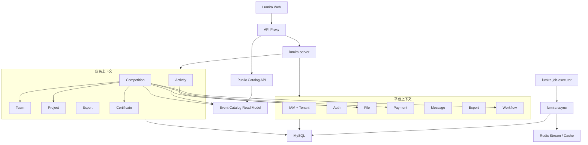

# Lumira 多租户业务平台完整架构设计

状态：Proposed

日期：2026-07-20

适用范围：当前 Lumira 仓库、活动/赛事入驻、报名配置、团队与项目、专家、评审、证书、支付、文件、全站导出、异步任务、部署和数据库迁移。

## 1. 结论

Lumira 应继续采用现有的 DDD 模块化单体和三运行时部署方式，不立即拆成物理微服务。目标改造集中在四个方面：

1. 建立真实的租户上下文，让每个入驻方可以管理多个活动和赛事，并从身份、权限、SQL、缓存、文件、任务和审计层强制隔离。
2. 把活动、赛事、项目、专家、证书和工作流从 `lumira-system` 的宽泛 PLATFORM 上下文中逐步拆成明确的业务限界上下文。
3. 活动和赛事保持独立业务模型；需要统一展示时，通过只读目录投影聚合，不通过管理查询混表，也不合并成一张通用 `event` 表。
4. 将报名数据改为“规范化核心数据 + 独立动态字段值 + 不可变提交快照”，并把全站导出升级为按数据量自适应、流式、可恢复的统一平台能力。

这是一项渐进式架构迁移。现有 API、表和部署拓扑在迁移期间继续工作，通过增加字段、双写、回填、影子校验和按域切流完成演进，避免一次性重写。

## 2. 设计假设

本方案暂按以下业务模型设计：

- 一个入驻方是一个租户。
- 一个租户可以创建和管理多个活动、多个赛事。
- 租户管理员默认只能访问本租户数据。
- 租户内部还可以把运营人员分配到指定活动或指定赛事。
- 平台管理员可以跨租户，但必须显式进入平台态或租户代理态，并留下审计记录。
- 普通报名用户可以参加不同租户的公开活动或赛事，但报名记录仍归属对应租户和资源。
- “成员角色”等报名字段属于业务提交数据，不是 IAM 系统角色。

如果未来入驻单位不是隔离边界，而只是赛事的展示字段，可以简化租户模型，但不能取消 `competition_id` / `activity_id` 的资源级隔离。

## 3. 审计范围与事实基线

### 3.0 证据优先级

仓库文档仅作为历史意图和约束参考，不作为“能力已经落地”的证明。本方案按以下优先级判断现状：

1. 当前源码的实际调用链、权限判断和 SQL。
2. 当前 `saas.sql`、正式 migration 和生产 Compose/启动脚本。
3. 可以执行的架构测试、迁移契约测试和模块测试。
4. Git 中的模块依赖、路由和运行配置。
5. 架构/产品文档中的目标描述。

当文档与代码冲突时，以代码和可执行配置为现状，并把冲突登记为文档漂移。例如多租户文档描述了 tenant membership，但当前基线的 `CurrentUser`、请求 header 和数据库表并没有形成相应闭环，因此本方案把多租户判定为未落地，而不是已完成能力。

### 3.1 当前运行拓扑

当前生产设计为：

```text
Browser
  -> api-proxy
  -> lumira-server       同步请求与控制面
  -> lumira-async        Outbox relay 和后台处理
  -> lumira-job-executor XXL-JOB 调度适配
  -> MySQL / Redis / File Storage
```

该拓扑具备继续演进的基础：同步入口单一，异步与调度已物理分开，Docker Compose 已包含蓝绿发布和可观测组件。当前阶段没有必要引入 Kubernetes、Kafka 或多数据库分片。

### 3.2 当前代码规模与集中度

- 后端 `lumira-system` 约 400 个 Java 源文件，显著大于其他模块。
- `lumira-system/modules/system` 约 181 个文件，同时还承载 activity、competition、project、expert、workflow 等业务包。
- 前端 `CompetitionPage.tsx` 约 7,381 行，承担赛事管理、赛事创建、赛事配置、报名、支付结果以及活动报名路由分发。
- `ProjectPage`、`TeamPage`、`ActivityPage` 等也存在单页千行以上的聚合组件。
- 初始化 SQL 当前约 132 张表，租户目标写在文档中，但业务主表没有 `tenant_id`。

### 3.3 当前已有的正确基础

- 活动表和赛事表已经独立：`aiadc_activity` / `aiadc_activity_registration` 与 `aiadc_competition` / `competition_registration` 没有共用主表。
- 活动、赛事、项目、专家在 Java 包和前端 service 目录中已有初步领域命名。
- Team、File、Payment、Message、Plugin、Localization 等已经有独立 Maven 模块或稳定 Internal API。
- 赛事报名已保存团队、项目、成员、采集结构和报名值快照。
- 赛程材料已使用 `registration_material_value` 这类独立字段值表。
- 用户导出已经具备 5,000 条以内同步、超过阈值异步的基本决策逻辑。
- 正式部署在启动应用容器前执行版本化迁移，迁移契约测试覆盖新库和旧库路径。
- 架构测试已经保护 Controller、模块依赖、表 owner 和新增持久化债务边界。

## 4. 关键问题与风险级别

| 级别 | 问题 | 当前表现 | 业务风险 |
| --- | --- | --- | --- |
| P0 | 多租户尚未真正实现 | `CurrentUser` 没有有效 `tenantId`；兼容构造器中的 scope 参数被忽略；请求层不发送租户上下文；业务表没有 `tenant_id` | 多入驻方后存在跨租户读取和写入风险 |
| P0 | 查询只区分“本人/全部” | 赛事报名和活动报名管理没有强制 resource scope；拥有 view-all 权限时查询整个表 | 多赛事之间数据混合，导出也可能越界 |
| P1 | 业务域集中在 system-service | manifest 把活动、赛事、报名、项目、专家、证书和工作流暂归 PLATFORM | system-service 继续膨胀，owner 和发布边界不清晰 |
| P1 | 前端按路径手工分发 | `/activities/register` 加载 competition 页面；CompetitionPage 根据 pathname 返回不同业务页 | 路由、状态和依赖互相污染，回归范围扩大 |
| P1 | 超大 AppService 直接 SQL | CompetitionRegistrationAppService、CompetitionManagementAppService 和 WorkflowAppService 在债务白名单中 | 事务、权限和持久化规则难以独立测试和迁移 |
| P1 | 全站导出未平台化 | 目前正式自适应导出主要覆盖用户管理；异步导出仍全量加载 List 并生成内存 XLSX | 大数据量可能触发高内存、长 GC、OOM 或请求卡死 |
| P1 | 初始报名动态值主要在 JSON | 独立字段定义存在，但初始报名值主要依赖多个 snapshot JSON | 条件查询、字段级权限、统计和宽表导出成本高 |
| P2 | API 版本与资源层级不统一 | 平台文档以 `/v1` 为主，新增业务大量使用 `/v2/aiadc`，资源父子关系没有稳定表达 | 客户端和开放接口演进困难 |
| P2 | 数据库关系主要靠应用维护 | 主 SQL 中几乎没有外键，存在 ID、UUID、文本 organizer 和快照并存 | 回填、删除和跨域引用需要额外一致性校验 |
| P2 | 文档目标与代码事实不一致 | 文档描述 `sys_user_tenant` 等模型，但当前基线中没有相应表 | 评审时容易误判能力已落地 |

## 5. 方案比较

### 方案 A：模块化单体 + 真实租户边界 + 只读目录投影

这是推荐方案。继续保持一个同步部署单元，在 Maven 和代码层建立业务 owner；活动和赛事独立写模型，通过事件构建公共目录投影。优点是迁移可控、事务简单、部署成本低，并保留未来按模块物理拆分的可能。

### 方案 B：统一 Event 主表 + Activity/Competition 扩展表

可以统一标题、时间、地点和公开搜索，但会把差异很大的报名、赛程、评审、材料和收费生命周期放到同一个抽象根下。当前代码已经分表，强行合并需要大迁移，并容易形成大量类型判断。暂不采用。

### 方案 C：立即拆成活动、赛事、报名等物理微服务

能够独立扩容和发布，但当前业务边界、租户模型和契约尚未稳定，会提前引入分布式事务、服务发现、重试、跨服务调试和多套迁移的复杂度。暂不采用。只有模块边界稳定且确有独立扩容/故障隔离需求时再评估。

## 6. 目标总体架构



物理运行仍是 `lumira-server`、`lumira-async` 和 `lumira-job-executor` 三个运行时。图中的上下文首先表现为 Maven/包/数据 owner 和契约边界，不等于新增多个生产进程。

## 7. 限界上下文与所有权

| 上下文 | 建议模块 | 拥有的数据 | 不拥有的数据 |
| --- | --- | --- | --- |
| IAM/TENANT | `lumira-system` 内明确子上下文，后续可独立 | tenant、membership、role、permission、resource assignment、permission snapshot | 活动、赛事和报名业务值 |
| ACTIVITY | `lumira-activity` | 活动、活动报名、活动表单定义和活动报名值 | 赛事配置与赛程 |
| COMPETITION | `lumira-competition` | 赛事、配置版本、赛事报名、团队/项目/成员提交快照、赛程、材料、评审、支付编排 | 正式用户角色、正式团队主数据、支付订单主数据 |
| TEAM | 现有 `lumira-team` | 正式团队、成员、邀请、申请 | 报名时提交的团队证据快照 |
| PROJECT | `lumira-project` | 可复用正式项目主数据 | 某次报名的项目提交快照与报名扩展字段 |
| EXPERT | `lumira-expert` | 专家库主数据、专家申请状态 | 赛事评审任务和评分结果 |
| CERTIFICATE | `lumira-certificate` | 模板、版本、批次、证书记录和公开核验 | 赛事晋级规则 |
| WORKFLOW | `lumira-workflow` | 流程定义、节点、实例、任务和动作日志 | 专家/报名实体本身 |
| EXPORT | `lumira-export` | 导出任务、租约、进度、结果文件引用和清理策略 | 各业务域的查询规则和字段权限 |
| CATALOG | 可先置于 `lumira-system` 的 read model 包 | 面向公开查询的 activity/competition 摘要投影 | 管理写入和报名数据 |

第一批应只新建 `lumira-activity`、`lumira-competition`、`lumira-export` 三个模块。Project、Expert、Certificate、Workflow 可以在第二批迁移，避免同时移动过多代码。

## 8. 真实多租户模型

### 8.1 身份模型

建议新增：

```text
sys_tenant
  id, uuid, code, name, status, plan_code, settings_json

sys_tenant_membership
  id, tenant_id, user_id, user_uuid, status, joined_at

sys_tenant_user_role
  id, tenant_id, membership_id, role_id

sys_resource_assignment
  id, tenant_id, resource_type, resource_id, membership_id, assignment_role
```

`resource_type` 第一阶段只允许固定枚举 `ACTIVITY`、`COMPETITION`，不允许任意字符串扩展成隐式权限系统。

`sys_role` 增加 `tenant_id` 和 `scope_level`。平台内置角色属于保留的平台租户；租户自定义角色属于具体租户。`role_code` 的唯一键改为包含 `tenant_id`。

### 8.2 当前用户上下文

`CurrentUser` 必须明确包含：

```text
userId / userUuid
tenantId / tenantUuid
membershipId
platformMode
roleIds
permissionKeys
dataScopeSummary
sessionId / permissionVersion
```

租户切换通过受保护接口完成，服务端验证 membership 后签发绑定新 tenant 的 access token 和权限快照。前端可以发送 `X-Tenant-Id` 作为上下文一致性校验，但后端只信任已验证 token/session；header 与 token 不一致时返回 403。

### 8.3 授权顺序

每个管理请求按固定顺序校验：

1. 会话可信。
2. 当前租户有效，用户 membership 有效。
3. 拥有功能权限，例如 `competition:registration:view`。
4. 资源属于当前租户。
5. 数据范围允许访问该 competition/activity 或 owner 数据。
6. 敏感字段权限允许返回或导出对应字段。
7. 跨租户平台操作写审计日志。

非平台态的 Repository 查询接口必须要求 `TenantScope` 或 `ResourceScope` 参数，禁止提供隐式全表方法。

## 9. 活动与赛事的数据边界

### 9.1 活动域

活动适合轻量生命周期：发布、报名、签到或完成。建议：

```text
activity
activity_form_definition
activity_form_field
activity_registration
activity_registration_field_value
```

所有表带 `tenant_id`；报名表同时带 `activity_id`、`owner_user_id`。活动报名管理必须以 `(tenant_id, activity_id)` 为基本查询边界。

### 9.2 赛事域

赛事包含更强的聚合关系：

```text
competition
competition_config_set
competition_form_field
competition_stage
competition_stage_form
competition_registration
competition_registration_team
competition_registration_project
competition_registration_member
competition_registration_field_value
registration_material_submission/value/revision
competition_review_result
competition_payment_order_task
```

`competition_registration` 是一次赛事报名的聚合根。正式 Team/Project 仅通过可空 `source_team_id` / `source_project_id` 引用；提交时的内容进入报名自己的 team/project/member 表和不可变快照，不因正式主数据后续修改而改变历史证据。

### 9.3 不合并活动和赛事

- 两者不共用管理主表。
- 两者不共用报名主表。
- 两者可以共享字段类型枚举、验证组件和导出协议，但不能共享 owner 数据。
- 公共页面的统一搜索只读 `event_catalog_item` 投影。

## 10. 报名字段与提交存储

### 10.1 字段定义

每个字段定义必须有稳定、不随标题变化的 key：

```text
field_key
scope: REGISTRATION | TEAM | PROJECT | MEMBER
data_type
label
required
options_json
validation_json
exportable
sensitive_level
sort_order
definition_version
```

成员业务角色使用 `scope=MEMBER`、`field_key=role` 或完整标识 `member.role`，值存入报名成员/字段值表。IAM 角色只存在于 `sys_role` / tenant role 关系中，两者没有外键、字段复用或权限解释关系。

### 10.2 值存储

建议采用三层结构：

1. 高频核心字段使用规范化列，例如报名号、状态、费用、成员数和联系人。
2. 团队、项目、成员使用独立报名子表，避免把所有数据长期塞进 JSON。
3. 动态字段使用 typed value 表：

```text
competition_registration_field_value
  tenant_id
  competition_id
  registration_id
  subject_type
  subject_id
  field_key
  field_type
  text_value
  number_value
  date_value
  boolean_value
  json_value
  file_id
```

唯一键为 `(registration_id, subject_type, subject_id, field_key, deleted)`。导出和筛选优先读取规范化表，不在热路径对大 JSON 做 `JSON_EXTRACT`。

### 10.3 快照策略

现有 `registration_snapshot_json`、`team_snapshot_json`、`project_snapshot_json`、`member_snapshot_json` 和 `collection_schema_snapshot_json` 继续保留，职责改为：

- 证明提交时用户看到了什么表单、提交了什么内容。
- 支持历史回放和争议审计。
- 兼容旧数据和紧急恢复。

快照不是管理查询、统计和大批量导出的主数据源。提交事务同时写规范化数据与快照，并写校验摘要；迁移期间通过双写比对保证一致性。

## 11. 公共目录读模型

新增只读投影：

```text
event_catalog_item
  tenant_id
  source_type       ACTIVITY | COMPETITION
  source_id
  source_uuid
  title
  summary
  status
  registration_start/end
  event_start/end
  location
  image_url
  tags
  featured
  sort
  version
  updated_at
```

Activity 和 Competition 在发布、撤回、归档或更新公开信息时，在同一事务写 Outbox。异步消费者幂等更新目录投影。

允许目录存在秒级最终一致性。管理页面和报名确认永远查询 owner 表，不依赖目录投影。目录消费者失败时，公开搜索可能短暂陈旧，但不会破坏业务写入；监控 backlog 并提供按 source 重建投影的运维命令。

## 12. API 设计

### 12.1 管理 API

建议目标路径：

```text
GET  /api/v2/tenants/current/activities
POST /api/v2/tenants/current/activities
GET  /api/v2/activities/{activityId}/registrations

GET  /api/v2/tenants/current/competitions
POST /api/v2/tenants/current/competitions
GET  /api/v2/competitions/{competitionId}
GET  /api/v2/competitions/{competitionId}/registrations
POST /api/v2/competitions/{competitionId}/exports
```

URL 中的资源 ID 只表达资源层级，实际 tenant 仍从可信上下文获得。查询不到当前租户内的资源时返回 404，避免泄露其他租户资源是否存在。

### 12.2 报名 API

```text
GET  /api/v2/public/catalog/events
GET  /api/v2/public/competitions/{competitionUuid}/registration-form
POST /api/v2/competitions/{competitionUuid}/registrations/drafts
POST /api/v2/competitions/{competitionUuid}/registrations/{registrationId}/confirm
GET  /api/v2/me/competition-registrations
```

创建、确认、支付下单和材料提交必须支持幂等键。报名确认使用服务端读取的已发布配置版本和价格，不信任前端传入的费用或字段定义。

### 12.3 兼容策略

现有 `/api/v2/aiadc/*` 在迁移期作为兼容入口调用新 Application Facade，不复制业务逻辑。响应增加 `Deprecation`/文档提示，前端分域迁移完成后再移除旧入口。

## 13. 前端目标结构

```text
src/
├─ app/                         启动、路由和全局 provider
├─ features/
│  ├─ tenant/                  当前租户、切换和权限上下文
│  ├─ activity/
│  │  ├─ management/
│  │  └─ registration/
│  ├─ competition/
│  │  ├─ management/
│  │  ├─ settings/
│  │  ├─ registration/
│  │  ├─ review/
│  │  └─ payment/
│  └─ export/                  任务状态、下载中心和通用交互
├─ pages/                      轻量路由入口
└─ services/                   按领域的 API client 和类型
```

规则：

- 每个路由直接加载对应 page，不在一个页面里根据 `location.pathname` 分发其他业务域。
- `/activities/register` 只能依赖 Activity feature/service。
- Project 页面不能继续从 competition service 导入 Project API；应有独立 `services/project`。
- React Query key 必须包含 `tenantId` 和必要的 `competitionId/activityId`。
- 租户切换时取消旧请求、清理租户级 cache、重新加载权限和菜单。
- 页面不直接拼 API，不直接持有系统角色语义，也不把报名成员角色写入权限状态。
- 超过约 800 行的页面优先按 page controller、domain hook、section component 拆分；这是治理触发器，不是机械失败阈值。

## 14. 全站自适应导出架构

### 14.1 统一协议

每个可导出领域实现 `ExportProvider`：

```text
providerKey()
listFields(scope, resource)
authorize(actor, scope, fields)
estimateCount(filterSnapshot)
openCursor(filterSnapshot, afterId, batchSize)
mapRow(record, selectedFields)
```

Export 平台拥有任务和执行协议，业务 owner 拥有查询、字段解释、脱敏与数据权限。Export 平台不得直接跨域查询业务表。

### 14.2 同步与异步决策

- 默认阈值沿用 5,000 条，但配置化到 provider；可同时按估算字节数、列数和格式降低阈值。
- 小于等于阈值：同步流式响应，不把 Base64 放入 JSON。
- 超过阈值：创建导出任务，在 Download Center 展示进度和结果。
- 如果 count 代价过高，provider 可以基于统计信息或分页探测返回估算值；一旦同步执行超过安全预算，自动转异步。

### 14.3 异步任务字段

在现有 `sys_export_task` 上渐进增加：

```text
tenant_id
resource_type / resource_id
filter_snapshot_json
permission_snapshot_version
mode / format
progress / processed_count
cursor_json
heartbeat_at
retry_count / next_retry_at
file_id / file_name / file_size
expires_at
cancel_requested
```

请求创建任务和 Outbox 事件必须在同一事务。`lumira-async` 消费事件；XXL-JOB 只负责扫描遗漏、回收超时租约和定时清理，不承担业务 owner 逻辑。

### 14.4 内存与文件策略

- 数据读取使用稳定的 keyset cursor，例如 `(id > lastId)`，批次建议 500～2,000，禁止 `loadAllUsers` 风格的全量 List。
- XLSX 使用 `SXSSFWorkbook` 临时窗口或直接写临时文件；超大数据优先 CSV/ZIP。
- 不返回 Base64 XLSX；同步导出直接写 HTTP response stream。
- Excel 超过 1,048,576 行时自动拆 sheet 或输出多个 CSV 后打 ZIP。
- 生成完成后通过 File owner API 保存文件，下载链接短期签名，默认到期清理。
- 每批重新验证任务未取消；敏感字段权限撤销后停止任务并记录审计。

## 15. 异步、事件和一致性

### 15.1 使用 Outbox 的场景

- Activity/Competition 发布后更新公共目录。
- 报名确认后创建支付编排任务、通知或统计投影。
- 支付成功后更新报名支付状态。
- 大批量导出任务派发。
- 证书生成和通知。

### 15.2 不使用事件替代本地事务

一次报名确认中的报名主表、成员/项目/团队提交数据、动态字段值、配置快照和 Outbox 必须在同一数据库事务提交。不能为了“事件化”拆成多个最终一致写入，否则用户可能拿到不完整报名。

### 15.3 消费要求

- 每个事件有 eventId、tenantId、aggregateType、aggregateId、version、occurredAt、traceId。
- 消费者通过 `event_consumer_receipt` 或业务唯一键幂等。
- 采用 at-least-once，不假设 exactly-once。
- 乱序事件按 aggregate version 丢弃旧版本或进入重建队列。
- dead letter、backlog、最大延迟和重放操作必须可观测、可审计。

## 16. 数据库与迁移策略

### 16.1 表与索引原则

- 所有租户业务聚合根带 `tenant_id NOT NULL`。
- 高频独立查询的子表同样冗余 `tenant_id`，并通过事务和校验保证与父表一致。
- 租户表唯一键、状态索引和导出索引都以 `tenant_id` 开头。
- 管理分页保留稳定次排序 `id`；深分页和导出使用 keyset cursor。
- JSON 只承载配置元数据和证据快照，不承载高频筛选字段。

建议关键索引：

```text
competition(tenant_id, deleted, status, updated_at, id)
activity(tenant_id, deleted, status, updated_at, id)
competition_registration(tenant_id, competition_id, deleted, status, id)
activity_registration(tenant_id, activity_id, deleted, status, id)
competition_registration_field_value(tenant_id, competition_id, field_key, deleted, registration_id)
sys_export_task(tenant_id, status, next_retry_at, created_at, id)
event_catalog_item(source_type, status, featured, event_start, id)
```

### 16.2 零停机迁移顺序

每次大型字段迁移采用 Expand → Backfill → Dual Read/Write → Enforce → Contract：

1. 新增可空列/新表和索引，不改变旧读写。
2. 创建 legacy tenant，将现有数据分批回填。
3. 新写路径双写 tenant 和规范化报名值。
4. 影子读取比较新旧结果、行数和摘要，不影响用户响应。
5. 切换管理查询、报名详情和导出读取新模型。
6. 将 `tenant_id` 设为 NOT NULL，增加一致性约束或守卫。
7. 观察稳定后再停止旧写；快照列长期保留，不立即删除。

当前正式 migrator、baseline SQL 和 migration contract 测试继续保留。所有变更同时更新新库 `saas.sql` 和旧库 `deploy/migrations`，并验证空库初始化、旧版本升级、失败停止和重复执行。

## 17. 部署与伸缩

### 17.1 近期

继续使用：

- `api-proxy`
- 蓝/绿 `lumira-server`
- `lumira-async`
- `lumira-job-executor`
- MySQL 8.4
- Redis 7.4
- 共享文件卷或兼容对象存储
- Prometheus/Grafana/Loki/Tempo/Alloy

优先扩展异步 worker 并限制每个 tenant 的并发任务，避免大租户占满队列。不要为了模块拆分增加更多同步容器。

### 17.2 中期

当数据库或文件存储成为单点时，优先升级为：

- MySQL 主备或托管高可用实例，开启 binlog 和时间点恢复。
- 对象存储替代单机上传卷。
- Redis 托管实例或具备持久化/故障恢复的部署。
- `lumira-async` 多副本，通过租约安全抢占任务。

只有某一业务域满足独立表族、独立峰值、独立发布和稳定契约等至少两个条件时，才评估物理微服务拆分。

## 18. 非功能需求与验收目标

以下为方案验收目标，最终数值需结合真实流量压测确认：

| 类别 | 目标 |
| --- | --- |
| 租户隔离 | 跨租户读取/写入测试 100% 拒绝；平台跨租户操作 100% 审计 |
| 管理列表 | 在常用筛选和 100 行分页下，API p95 ≤ 500ms |
| 报名确认 | 不含外部支付耗时的本地事务 p95 ≤ 1s；重复幂等请求不产生重复订单/报名 |
| 公共查询 | catalog API p95 ≤ 300ms；投影正常延迟 ≤ 10s |
| 小导出 | 阈值内直接流式下载，不创建后台任务 |
| 大导出 | 请求 2s 内返回 taskId；100,000 行在基准环境可控完成且进程内存保持上限 |
| 可用性 | 业务目标 99.9%；异步依赖失败不阻塞核心本地事务 |
| 恢复 | 建议 RPO ≤ 1h、RTO ≤ 4h；每季度执行恢复演练 |
| 可观测 | 每个请求/任务包含 requestId、traceId、tenantId、resourceId 和 actor |
| 隐私 | 报名 PII 按字段授权、导出审计、下载到期、日志脱敏 |

## 19. 失败模式与处理

| 失败模式 | 影响 | 处理 |
| --- | --- | --- |
| tenant 上下文缺失或不匹配 | 可能越权 | 默认拒绝；公开接口走独立匿名上下文 |
| 资源 ID 属于其他 tenant | 资源枚举风险 | 返回 404，记录安全审计 |
| Redis 不可用 | 缓存和事件实时性下降 | 核心写入继续落库/Outbox；缓存回源；事件恢复后重放 |
| catalog 消费积压 | 公共列表陈旧 | 管理和报名仍读 owner；告警并允许重建投影 |
| export worker 崩溃 | 任务停滞 | lease 到期后重领，从 cursor 继续；输出临时文件幂等清理 |
| 导出字段权限被撤销 | 敏感数据继续生成 | 每批检查 permission version，失败并删除临时结果 |
| 支付接口超时 | 报名状态不确定 | 本地支付任务持久化、幂等查询/重试、Webhook 对账 |
| 双写不一致 | 新旧读取结果不同 | 摘要对账、记录差异、不切流；提供可重跑 backfill |
| 迁移失败 | 新版本无法启动 | migrator 在启动应用前停止；保留旧蓝/绿实例和数据库备份 |
| 单机 MySQL/文件卷故障 | 服务不可用或文件丢失 | 备份、PITR、对象存储/主备升级和恢复演练 |

## 20. 可观测性

新增统一维度：

```text
tenant.id
business.domain
resource.type
resource.id
competition.id / activity.id
actor.user_id
export.task_id
event.type / event.lag
```

关键指标：

- 按 tenant/domain 的请求量、错误率和 p95/p99。
- 无 tenant 上下文拒绝次数、tenant mismatch 次数。
- 报名确认成功率、幂等命中率、支付待处理时长。
- 导出 pending/running/failed 数、处理行数、吞吐、内存和文件大小。
- Outbox backlog、最大事件延迟、重试和 dead letter。
- catalog 投影版本差和重建状态。
- 慢 SQL、连接池等待、表扫描行数。

日志不得记录报名完整 JSON、身份证、手机号、密钥、支付凭证或导出文件内容。

## 21. 测试和架构守卫

### 21.1 架构测试

- Activity/Competition 模块不得依赖对方的 repository/entity/mapper。
- 新模块不能依赖 `system-service` 实现，只能依赖 API 契约。
- tenant-owned Repository 的管理查询必须要求 `TenantScope`。
- Controller 和 AppService 不得新增直接 SQL 债务。
- owner table manifest 增加 TENANT、ACTIVITY、COMPETITION、EXPORT、CATALOG 等上下文。
- 前端路由测试禁止 `/activities/*` 加载 competition page。
- Project 页面禁止依赖 competition service。

### 21.2 数据隔离测试

至少构造 Tenant A、Tenant B：

- 同名 activity/competition 并存。
- A 管理员不能读取/更新/删除/导出 B 数据。
- A 操作员只能访问被分配的 competition。
- 报名用户可以查看自己的跨租户报名，但每条记录保留 tenant/resource owner。
- 平台管理员切换租户前后权限、菜单、缓存和审计正确。

### 21.3 数据与迁移测试

- fresh database 与每个支持升级起点。
- tenant 回填行数、空值、孤儿引用和唯一键。
- JSON 快照到规范化值的抽样/全量 checksum。
- 双写失败时整个报名事务回滚。
- catalog 投影删除、重放、乱序和重建。
- 10k、100k、接近 Excel 行上限的导出，验证内存不随总行数线性增长。

## 22. 渐进实施路线

### 阶段 0：先建立防扩散守卫

交付：

- 接受本方案和 ADR。
- 增加新业务 AppService 禁止直 SQL、活动路由禁止 competition page、tenant-owned API 不允许无 scope 的架构规则。
- 为当前跨赛事/活动全量查询补充显式 `competitionId/activityId` 筛选入口和回归测试。

退出条件：新代码不再扩大混合边界。

### 阶段 1：建立 Tenant Spine

交付：

- tenant、membership、tenant role、resource assignment 表。
- `CurrentUser`、token/session、权限快照、前端 tenant context 和切换流程。
- legacy tenant 回填及所有高风险查询的 shadow scope 日志。

退出条件：双租户集成测试通过，现有单租户用户无感升级。

### 阶段 2：强制活动/赛事资源作用域

交付：

- activity/competition/registration 表增加 tenant_id 与索引。
- 管理 API 必须 tenant scoped；报名列表必须 resource scoped。
- 活动报名改为分页。
- 导出请求保存 tenant/resource/filter snapshot。

退出条件：非平台查询不存在隐式全表路径。

### 阶段 3：模块和前端拆分

交付：

- `lumira-activity`、`lumira-competition` Maven 模块和 owner manifest。
- AppService SQL 移入 Repository/Persistence Adapter。
- CompetitionPage 拆为独立路由页面；Project service 独立。
- 原 API 作为 facade 兼容。

退出条件：模块依赖和前端路由守卫通过，核心报名流程行为不变。

### 阶段 4：报名存储规范化

交付：

- registration team/project/member/value 表。
- 双写、回填、checksum、影子读取。
- 初始报名详情、管理查询和导出切到规范化数据。
- 快照保留为证据。

退出条件：新旧结果一致，字段级导出不解析大 JSON。

### 阶段 5：目录投影与全站 Export Platform

交付：

- event catalog、Outbox consumer、重建工具和公共查询。
- 通用 ExportProvider、流式 XLSX/CSV、任务续跑、取消、过期和下载中心。
- 逐页接入活动、赛事报名、项目、团队、专家、证书、支付、审计等导出。

退出条件：所有管理页导出都使用统一协议；100k 行基准测试无 OOM。

### 阶段 6：可靠性与容量

交付：

- tenant 级限流/配额、异步公平调度、完整指标和告警。
- 数据库 PITR、对象存储、恢复演练。
- 基于真实数据的索引和容量复核。

退出条件：达到确认后的 SLO，发布和恢复演练通过。

## 23. 回滚策略

- Tenant migration 在强制 NOT NULL 前允许关闭新 scope 读路径，但记录所有影子差异。
- 模块移动不改表名和外部 API 时，可通过装配开关切回旧 facade。
- 规范化报名值切流失败时回到 snapshot 读取，双写继续保留并修复差异。
- catalog 是可重建投影，可直接停用而不影响管理和报名。
- Export provider 失败不影响列表和写入；可临时关闭特定 provider，保留用户导出旧路径。
- 数据库 contract 阶段不立即删除旧列/旧表；删除必须在至少一个稳定发布周期后单独执行。

## 24. 代码证据索引与当前验证结果

以下文件是本方案判断“当前已经实现什么、还没有实现什么”的主要依据；它们的优先级高于历史说明文档：

| 结论 | 当前代码证据 |
| --- | --- |
| 当前用户上下文没有有效租户 | `lumira-backend/libs/lumira-common-security/src/main/java/com/lumira/common/security/CurrentUser.java`；兼容参数名为 `ignoredScopeId` |
| 前端请求没有租户上下文 | `lumira-ui/src/services/common/requestInternalsHeaders.ts` |
| 活动路由实际加载赛事页面 | `lumira-ui/src/routes/meta.ts`；`lumira-ui/src/pages/competition/CompetitionPage.tsx` |
| 赛事报名 view-all 查询缺少资源条件 | `lumira-backend/services/lumira-system/src/main/java/com/lumira/saas/modules/competition/app/CompetitionRegistrationAppService.java` |
| 活动报名管理采用本人或全量列表 | `lumira-backend/services/lumira-system/src/main/java/com/lumira/saas/modules/activity/app/ActivityRegistrationAppService.java`；`JdbcActivityRegistrationRepository.java` |
| 直接 SQL 是被允许的历史债务 | `doc/architecture/persistence-boundary-debt.md`；`ArchitecturePersistenceBoundaryTest.java` |
| 导出仅按 5,000 条切换，但仍全量占内存 | `UserExportAppService.java`；`ExcelExportService.java` |
| 新库与旧库升级入口不同 | `lumira-backend/sql/saas.sql`；`deploy/migrations/`；生产 Compose 和 migrator entrypoint |

本次审计已执行：

```text
node --test bin/database-migration-contract.test.mjs
结果：9 passed, 0 failed

./mvnw -pl services/lumira-system -am \
  -DskipTests=false \
  -Dtest=ArchitectureBoundaryTest,DddArchitectureBoundaryTest,ArchitecturePersistenceBoundaryTest \
  -Dsurefire.failIfNoSpecifiedTests=false test
结果：26 passed, 0 failed
```

这些通过结果证明当前迁移契约和既有架构守卫没有被破坏，但不能证明目标架构已经落地。特别是持久化架构测试会接受债务清单内的现存直 SQL。

## 25. 关键 ADR

- [ADR-0004：建立真实租户上下文和资源作用域](../../doc/adr/0004-establish-real-tenant-context.md)
- [ADR-0005：从 system-service 拆出业务限界上下文](../../doc/adr/0005-extract-business-bounded-contexts.md)
- [ADR-0006：活动和赛事独立写模型，公共查询使用目录投影](../../doc/adr/0006-use-event-catalog-read-model.md)
- [ADR-0007：报名采用规范化值和不可变快照双模型](../../doc/adr/0007-normalize-registration-values-and-keep-snapshots.md)
- [ADR-0008：采用全站自适应流式导出平台](../../doc/adr/0008-adopt-adaptive-streaming-export-platform.md)

## 26. 需要业务方最终确认的决策

开始实施前只需确认一个核心问题：入驻方是否是严格的数据隔离主体，并且一个入驻方可以管理多个活动/赛事。若答案为是，本方案的 Tenant → Resource 两级模型可以直接进入阶段 0 和阶段 1；若不是，需要重新定义谁是数据 owner，但 Activity 与 Competition 的业务边界、资源级查询和导出方案仍然成立。
